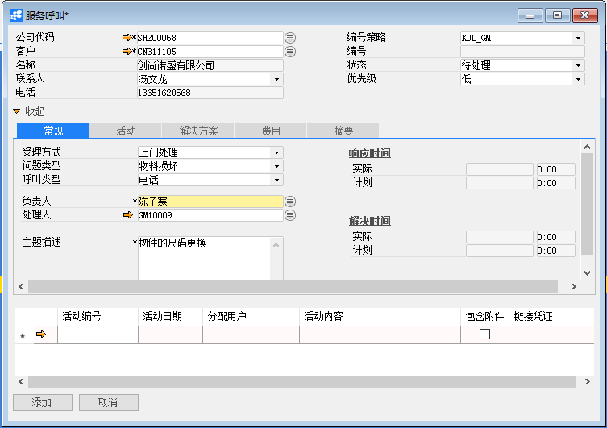
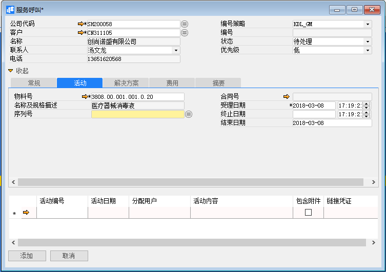
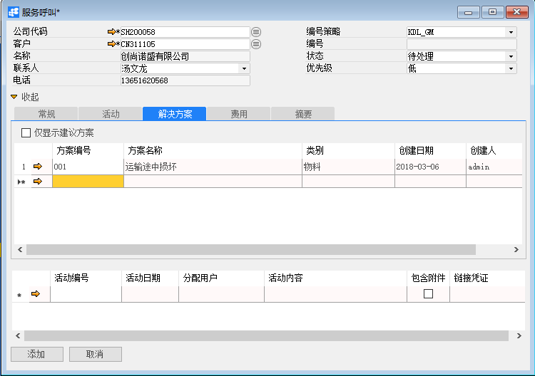
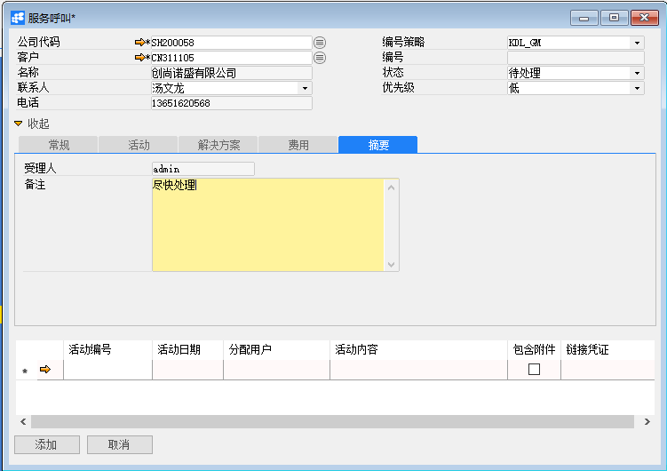
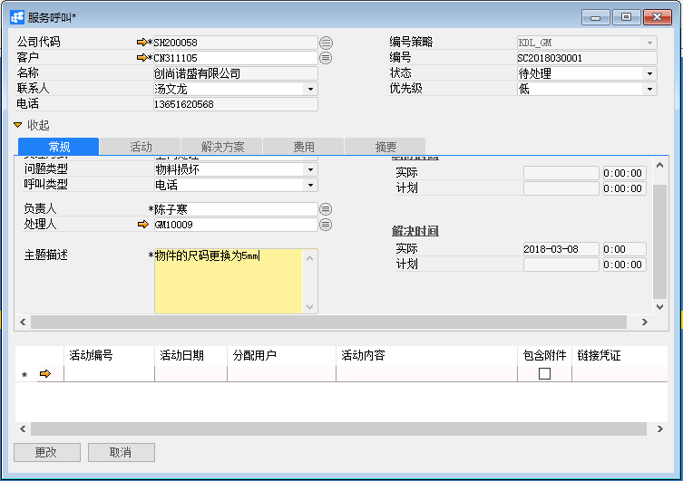
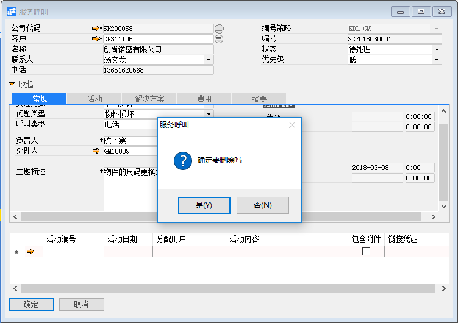

# 服务呼叫

## 功能解释

BAP服务呼叫支持提供客户的活动，例如跟踪客户的投诉和问题、提供这些问题的解决方案并查看与这些问题相关的活动，这些服务可以包含在服务合同。用户可以打开物料的服务呼叫，即使尚未定义相关客户服务跟踪卡或服务合同。

## 文章主旨

本文介绍如何通过BAP Nicer 5完成服务呼叫的新增、修改及删除操作。

## 操作要求

当前登陆用户拥有操作服务呼叫业务的权限，权限设置请在帮助文档中搜索查看。

## 新增服务呼叫

1.  从菜单栏【模块】->【服务】->【服务呼叫】,打开服务呼叫窗口；

2. 选择公司代码、客户（必须输入）、选择状态、优先级，点击【常规】选项卡的输入必要信息，例如受理方式（可定义新的，创建受理方式）、问题类别、呼叫类型及负责人等； 

                           

3. 点击【活动】选项卡，可选择的输入要维修的物料号及受理时间；

   

4. 点击【解决方案】选项卡，可选择的输入，在方案编号列输入处理解决方案代码；

   

5. 点击【摘要】选项卡，可选择的输入服务呼叫的备注信息；

   

6.  点击【添加】按钮，状态栏显示“新记录已保存！”信息，表示创建服务呼叫成功；
7.  点击工具栏按钮，发起审批。

## 修改服务呼叫

1.  从系统菜单->【服务】->【服务呼叫】，打开服务呼叫界面；

2. 点击工具栏的查询按钮，查找需要修改的服务呼叫，修改必要的数据；

   

3.  点击【更改】按钮，状态栏显示“更改已保存！”信息，表示修改服务呼叫成功；

4. 点击工具栏 按钮，发起审批。

## 删除服务呼叫

1.  从系统菜单->【服务】->【服务呼叫】,打开服务呼叫窗口；

2.  点击工具栏的浏览按钮，查找要删除的服务呼叫；

3. 点击工具栏的删除按钮，系统会提示删除确认。系统会提示确定要删除吗？点击【是】按钮，状态栏显示记录已删除，删除服务呼叫成功。

   

## 服务呼叫主数据

| **属性**       | **活动描述**                                                 |
| -------------- | ------------------------------------------------------------ |
| 公司代码       | 选择公司代码                                                 |
| 客户           | 选择服务合同对象客户                                         |
| 名称           | 只读字段，根据客户代码显示名称                               |
| 联系人         | 只读字段，根据客户代码显示联系人                             |
| 电话           | 只读字段，根据联系人显示联系人电话                           |
| 物料号         | 输入%模糊查找物料号                                          |
| 名称及规格描述 | 只读字段，根据物料号显示物料名称                             |
| 序列号         | 对服务类别为物料的服务合同呼叫时，才选择序列号（已定义物料服务跟踪卡） |
| 编号策略       | 根据公司代码，加载编号策略                                   |
| 编号           | 根据编号策略，加载编号，只有编号策略手动时，编号才可输入     |
| 状态           | 选择状态，在“服务->定义—>定义服务状态”中定义新的             |
| 优先级         | 选择服务呼叫处理级别                                         |

## 常规选项卡

| **属性**     | **活动描述**                                        |
| ------------ | --------------------------------------------------- |
| 受理方式     | 选择已存在的受理方式，选择定义新的…可以新增受理方式 |
| 问题类型     | 选择已存在的问题类型，选择定义新的…可以新增问题类型 |
| 呼叫类型     | 选择已存在的呼叫类型，选择定义新的…可以新增呼叫类型 |
| 负责人       | 选择负责人（这里指系统用户）                        |
| 处理人       | 选择处理人（这里指员工）                            |
| 主题描述     | 输入服务呼叫内容主题描述                            |
| 实际响应时间 | 只读字段，显示实际响应时间                          |
| 计划响应时间 | 只读字段，显示计划响应时间                          |
| 实际解决时间 | 只读字段，显示实际解决时间                          |
| 计划解决时间 | 只读字段，显示计划解决时间                          |

## 活动选项卡

| **属性** | **活动描述**                     |
| -------- | -------------------------------- |
| 活动编号 | 输入%模糊查找活动                |
| 活动日期 | 根据活动编号显示活动日期         |
| 分配用户 | 根据活动编号显示分配到活动的人员 |
| 活动内容 | 根据活动编号显示活动内容         |
| 包含附件 | 根据活动编号显示是否包附件       |
| 链接凭证 | 根据活动编号显示链接凭证         |

## 解决方案选项卡

| **属性** | **活动描述**                       |
| -------- | ---------------------------------- |
| 方案编号 | 输入%模糊查找方案                  |
| 方案名称 | 只读字段，根据方案编号显示方案名称 |
| 类别     | 只读字段，根据方案编号显示方案类别 |
| 创建日期 | 只读字段，根据方案编号显示创建日期 |
| 创建人   | 只读字段，根据方案编号显示创建人   |

## 附件呼叫选项卡

| **属性**   | **活动描述**                                   |
| ---------- | ---------------------------------------------- |
| 从磁盘选择 | 要附加文件，单击“从磁盘选择…”按扭，选择文件    |
| 移除       | 要删除的附加文件，选择显示文件，单击“移除”按扭 |
| 打开       | 要打开附加文件，选择显示文件，单击“打开”按扭   |

## 摘要选项卡

| **属性** | **活动描述**               |
| -------- | -------------------------- |
| 受理人   | 只读字段，显示系统用户     |
| 备注     | 输入服务呼叫的必要备注信息 |