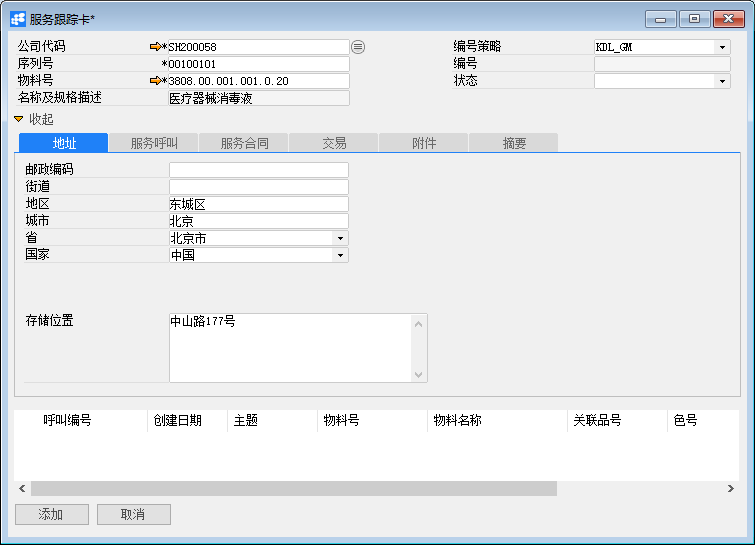
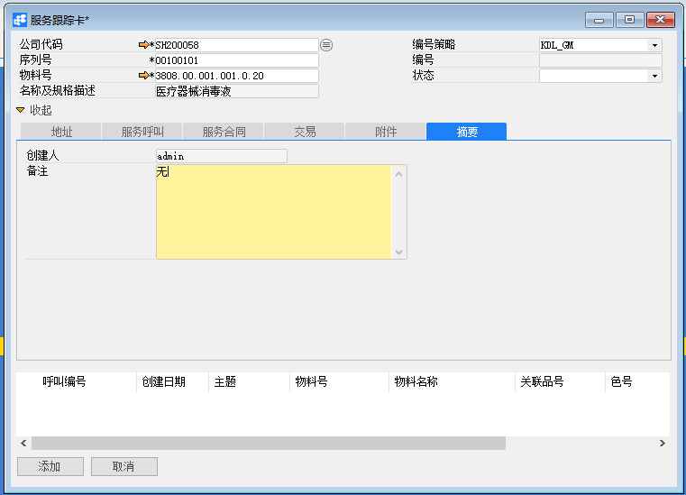
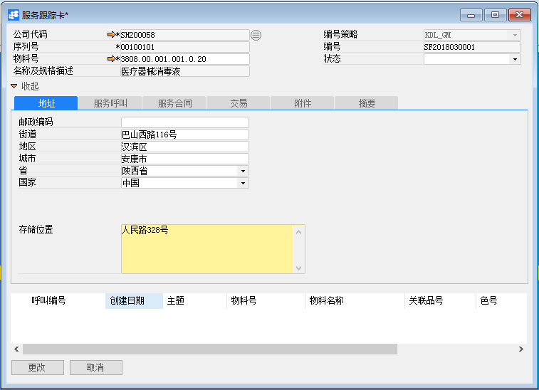
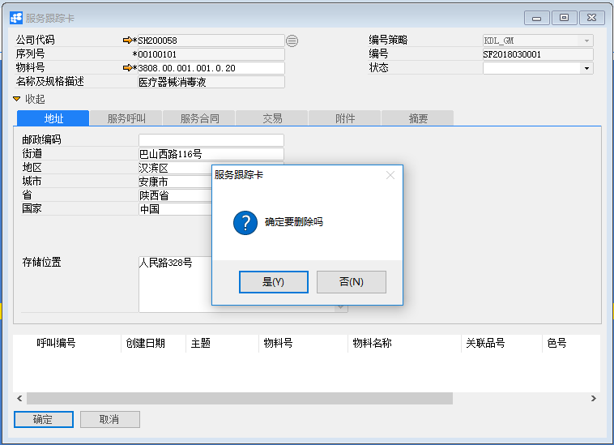

# 服务跟踪卡

## 功能解释

BAP服务跟踪卡包含用户向客户出售并可向其他提供服务的所有序列号物料，可从物料的出售日开始并在其整个服务间跟踪特定序列号的历史记录。

## 文章主旨

本文介绍如何通过BAP Nicer 5完成服务跟踪卡的新增、修改及删除操作。

## 操作要求

当前登陆用户拥有操作服务跟踪卡业务的权限，权限设置请在帮助文档中搜索查看。

## 新增服务跟踪卡

1. 从菜单栏【模块】->【服务】->【服务跟踪卡】,打开服务跟踪卡窗口；

2. 选择公司代码、序列号及物料（必须输入），点击【地址】选项卡的输入必要信息；

   

3. 点击【服务呼叫】选项卡，选择客户（必须输入），输入日期；

   

4. 点击【服务合同】、【交易】选项卡，只读查看数据，不需要输入；

   提示：当审核服务合同（状态为已批准）时，服务合同数据会添加到服务跟踪卡窗口【服务合同】选项下中；

5. 点击【附件】选项卡，可选择性的添加相关文件，包含【从磁盘选择…】、【打开】和【移除】功能，可接受的文件类型包含Word文件、Excel文件、文本文件、Adobe PDF文件、演示文档和电子文档等；

6. 点击【摘要】选项卡，输入服务跟踪卡的必要备注信息；

   

7. 点击【添加】按钮，状态栏显示“新记录已保存！”信息，表示创建服务跟踪卡成功。

## 修改服务跟踪卡

1. 从系统菜单->【服务】->【服务跟踪卡】，打开服务跟踪卡界面；

2. 点击工具栏的查询按钮，查找需要修改的服务跟踪卡，修改必要的数据；

   

3. 点击【更改】按钮，状态栏显示“更改已保存！”信息，表示修改服务跟踪卡成功；

## 删除服务跟踪卡

1. 从系统菜单->【服务】->【服务跟踪卡】,打开服务跟踪卡窗口；

2. 点击工具栏的浏览按钮，查找要删除的服务跟踪卡；

3. 点击工具栏的删除按钮，系统会提示删除确认。系统会提示确定要删除吗？点击【是】按钮，状态栏显示记录已删除，删除服务跟踪卡成功。

   

## 服务跟踪主数据

| **属性**       | **活动描述**                                             |
| -------------- | -------------------------------------------------------- |
| 公司代码       | 选择公司代码                                             |
| 序列号         | 输入物料的序列号，服务呼叫时涉及到                       |
| 物料号         | 输入%模糊查找物料号                                      |
| 名称及规格描述 | 只读字段，根据物料号显示物料名称                         |
| 客户           | 选择服务合同对象客户                                     |
| 名称           | 只读字段，根据客户代码显示名称                           |
| 联系人         | 只读字段，根据客户代码显示联系人                         |
| 电话           | 只读字段，根据联系人显示联系人电话                       |
| 编号策略       | 根据公司代码，加载编号策略                               |
| 编号           | 根据编号策略，加载编号，只有编号策略手动时，编号才可输入 |
| 状态           | 选择状态，在“服务->定义—>定义服务状态”中定义新的         |
| 创建日期       | 服务跟踪卡的生效日期                                     |
| 结否日期       | 服务跟踪卡的到期日期                                     |
| 终止日期       | 服务跟踪卡的终止日期                                     |

## 地址选项卡

| **属性** | **活动描述**                                                 |
| -------- | ------------------------------------------------------------ |
| 邮政编码 | 输入邮政编码                                        |
| 街道     | 输入街道                                                     |
| 地区     | 输入地区                                                     |
| 城市     | 选择城市                                                     |
| 省       | 选择省                                                       |
| 国家     | 选择国家                                                     |
| 存储位置 | 指定具有此序列号的物料地址，指定准确位置，这有利于技术员在库房中查找物料 |

## 服务呼叫选项卡

| **属性** | **活动描述**                       |
| -------- | ---------------------------------- |
| 呼叫编号 | 服务呼叫编号                       |
| 创建日期 | 服务呼叫创建日期                   |
| 主题     | 根据呼叫编号显示在服务呼叫中主题   |
| 物料号   | 根据呼叫编号显示在服务呼叫中物料号 |
| 物料名称 | 根据物料号显示物料名称             |
| 关联品号 | 根据物料号显示关联品号             |
| 色号     | 根据物料号显示色号                 |

## 服务合同选项卡

| **属性** | **活动描述**                             |
| -------- | ---------------------------------------- |
| 合同编号 | 服务合同编号                             |
| 服务类型 | 根据服务合同编号显示在服务合同中服务类型 |
| 开始日期 | 根据服务合同编号显示在服务合同中开始日期 |
| 结束日期 | 根据服务合同编号显示在服务合同中结束日期 |

## 附件选项卡

| **属性**   | **活动描述**                                   |
| ---------- | ---------------------------------------------- |
| 从磁盘选择 | 要附加文件，单击“从磁盘选择…”按扭，选择文件    |
| 移除       | 要删除的附加文件，选择显示文件，单击“移除”按扭 |
| 打开       | 要打开附加文件，选择显示文件，单击“打开”按扭   |

## 摘要选项卡

| **属性** | **活动描述**                 |
| -------- | ---------------------------- |
| 创建人   | 只读字段，显示系统登录用户名 |
| 备注     | 输入服务跟踪卡的必要备注     |

