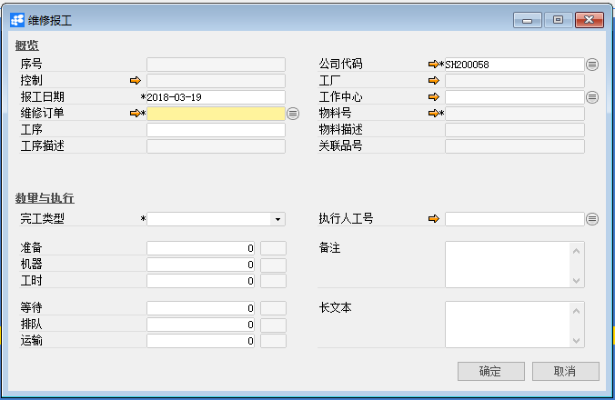
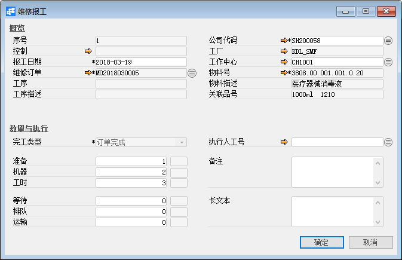
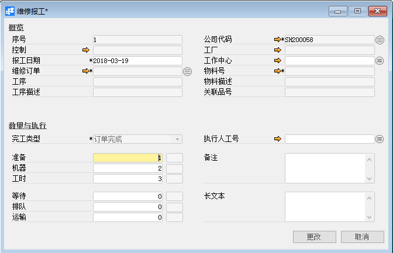
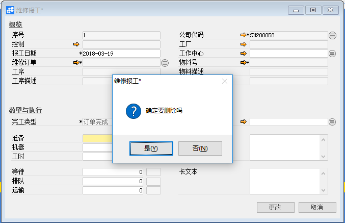

# 维修报工

## 功能解释

BAP维修报工是记录维修订单的进度完成情况。在维修报工中，如果执行人已属于维修报工组，则维修报工中的准备、机器、工时、等待时间可以由维修保工组人员同时完成，当然也可以手动分配每个执行人的维修报工时间比例。

## 文章主旨

本文介绍如何通过BAP Nicer 5完成维修报工的新增、修改及删除操作。

## 操作要求

当前登陆用户拥有操作维修报工业务的权限，权限设置请在帮助文档中搜索查看。

## 新增维修报工

1. 从菜单栏【模块】->【服务】->【报工】->【维修报工】,打开维修报工窗口；

   

2. 选择维修订单、完工类型及执行人工号等数据；

   

   提示：选择完工类型的提前条件以下四点注意。

   （1）、未完成->维修订单是否有工序都可以选择；

   （2）、订单完成->维修订单没有工序时可选择；

   （3）、工序完成->维修订单有工序时选择；

   （4）、全部完成->维修订单是否有工序都可以选择。

3. 点击【添加】按钮，如果是多人报工，则系统会打开维修多人报工，输入准备、机器等时间，点击【确定】按钮，状态栏显示新纪录已保存；

## 修改维修报工

1. 从菜单栏【模块】->【服务】->【报工】->【维修报工】,打开维修报工窗口；

2. 点击工具栏的查询按钮，查找需要修改的维修报工，修改必要的数据；

   

3. 点击【更改】按钮，状态栏显示“更改已保存！”信息，表示修改维修报工成功；

## 删除维修报工

1. 从菜单栏【模块】->【服务】->【报工】->【维修报工】,打开维修报工窗口；

2. 点击工具栏的查询按钮，查找要删除的维修报工；

   

3. 点击工具栏的删除按钮，系统会提示删除确认。系统会提示确定要删除吗？点击【是】按钮，状态栏显示记录已删除，删除维修报工成功。

## 属性与活动描述

| **属性**   | **活动描述**                                                 |
| ---------- | ------------------------------------------------------------ |
| 序号       | 显示创建成功后自动生成的维修报工单编号                       |
| 控制       | 显示成本中心报表凭编号                                       |
| 报工日期   | 输入维修报工日期，默认系统当前时间                           |
| 维修订单   | 选择维修订单                                                 |
| 工序       | 显示工序号                                                   |
| 工序描述   | 显示工序描述                                                 |
| 公司代码   | 选择公司代码                                                 |
| 工厂       | 根据维修订单显示工厂                                         |
| 工作中心   | 根据维修订单显示工作中心                                     |
| 物料号     | 根据维修订单显示物料号                                       |
| 物料描述   | 根据物料号显示物料描述                                       |
| 关联品号   | 根据物料号显示关联品号                                       |
| 完工类型   | 选择完工类型：   1、未完成—> 维修订单是否有工序都可以选择  2、订单完成—> 维修订单没有工序时选择  3、工序完成—> 维修订单有工序时选择  4、全部完成—> 维修订单是否有工序都可以选择 |
| 执行人工号 | 选择执行人工号，也就是选择员工                               |
| 准备       | 输入准备时间                                                 |
| 机器       | 输入机器时间                                                 |
| 工时       | 输入工时时间                                                 |
| 等待       | 输入等待时间                                                 |
| 排队       | 输入排队时间                                                 |
| 运输       | 输入运输时间                                                 |
| 备注       | 输入维修报工的必要备注                                       |
| 长文本     | 输入维修报工的必要描述                                       |

