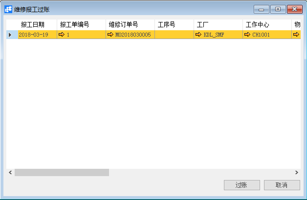
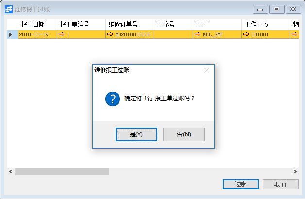

# 维修报工过账

## 功能解释

BAP维修报工过账根据维修报工的费用记录到维修订单成本中心过程。

## 文章主旨

本文介绍如何通过BAP Nicer 5完成维修报工过账的操作。

## 操作要求

当前登陆用户拥有操作维修报工过账业务的权限，权限设置请在帮助文档中搜索查看。

## 维修报工过账

1. 从菜单栏【模块】->【服务】->【报工】->【维修报工过账】,打开维修报工过账窗口；

2. 选择需要过账的维修报工（选中行，底色为橘黄色）；

   

3. 点击【过账】按钮，系统会提示确定将*（选中行数）行报工单过账吗？点击【是】按钮，维修报工过账成功。

   

## 属性与活动描述

| **属性**     | **活动描述**           |
| ------------ | ---------------------- |
| 报工日期     | 显示维修报工日期       |
| 报工编号     | 显示维修报工编号       |
| 维修订单号   | 显示维修订单号         |
| 工序号       | 显示维修工序号         |
| 工厂         | 显示维修工厂           |
| 工作中心     | 显示维修工作中心       |
| 物料号       | 显示维修物料号         |
| 名称规格描述 | 显示物料名称           |
| 关联品号     | 显示物料关联品号       |
| 色号         | 显示物料色号           |
| 色别         | 显示物料色别           |
| 单位         | 显示物料单位           |
| 准备         | 显示维修报工准备时间   |
| 机器         | 显示维修报工机器时间   |
| 工时         | 显示维修报工工时时间   |
| 等待         | 显示维修报工等待时间   |
| 排队         | 显示维修报工排队时间   |
| 运输         | 显示维修报工运输时间   |
| 执行人       | 显示维修报工执行人工号 |

