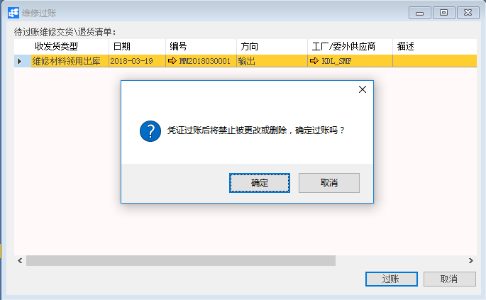

# 维修收发货过账

## 功能解释

BAP维修收发货过账可以一次性过账多个已批准的维修收发货单，完成过账后，维修收发货数量影响库存数量值。

## 文章主旨

本文介绍如何通过BAP Nicer 5完成维修收发货过账的操作。

## 操作要求

当前登陆用户拥有操作维修收发货过账业务的权限，权限设置请在帮助文档中搜索查看。

## 维修收发货过账

1. 从菜单栏【模块】->【服务】->【物料转移】->【维修收发货过账】,打开维修收发货过账窗口；

2. 选择要过账的收发货单据，选中行颜色为橘红色；

   

3. 点击【过账】按钮，系统提示“凭证过账后将禁止被更改或删除，确定过账吗？”的确认窗口，点击【确定】按钮，状态栏显示“执行成功”，则维修收发货过账成功。

   

   提示：过账维修收发货时遇到的问题及解决方法事例。

   （1）、当过账时报“***物料成本缺失？”，解决方法是创建一般入库（注意物料代码和仓库一致），输入价格；

   （2）、当过账时报“凭证行[科目:***]被定义为成本要素，必须指定一个(默认)成本对象？”，解决方法是，过账的维修收发货单物料明细里必须输入个对象（成本中心、内部订单、生产订单等）；

   （3）、当过账时报“总账科目编号策略缺失”，解决方法是定义公司代码中，日记账分录自动编号策略选择一个值。

## 属性与活动描述

| **属性**        | **活动描述**                                                 |
| --------------- | ------------------------------------------------------------ |
| 收发货类型      | 显示维修收发货类型                                           |
| 日期            | 显示维修收发货创建日期                                       |
| 编号            | 显示维修收发货来源单据                                       |
| 方向            | 显示维修收发货方向：  1、输出­—表示维修发货  2、输入—表示维修收货 |
| 工厂/委外供应商 | 显示维修收发货工厂或委处供应商信息                           |
| 描述            | 显示维修收发货描述信息                                       |

