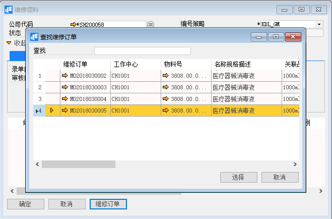
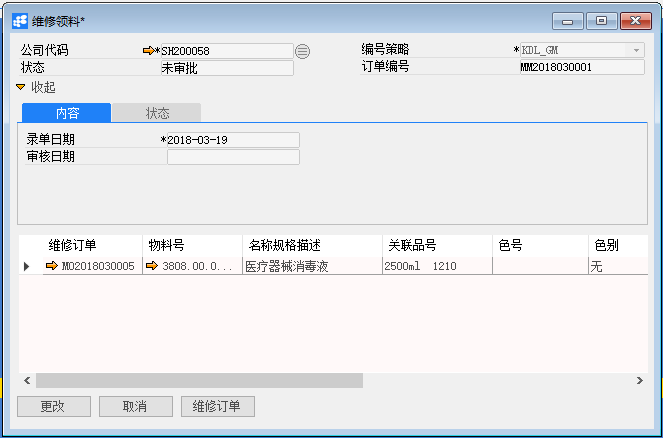
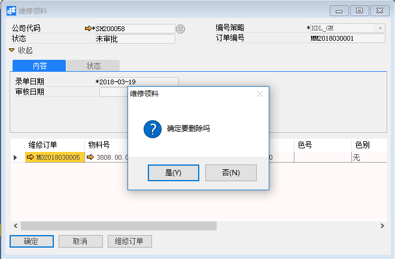

# 维修领料单

## 功能解释

BAP维修领料只能根据已下达的维修订单来，主要目的是领取维修订单中需要物料的数量，也是维修收发货的前提条件之一。

## 文章主旨

本文介绍如何通过BAP Nicer 5完成维修领料单的新增、修改及删除操作。

## 操作要求

当前登陆用户拥有操作维修领料单业务的权限，权限设置请在帮助文档中搜索查看。

## 新增维修领料单

1. 从菜单栏【模块】->【服务】->【物料转移】->【维修领料】,打开维修领料窗口；

2. 点击【维修订单】按钮，选择已下达的维修订单，点击【选择】按钮；

   

3. 对时间、数量、备注信息可必要更改；

   

4. 点击【添加】按钮，状态栏显示“新记录已保存！”信息，表示创建维修领料成功；

5. 点击工具栏按钮，发起审批。

## 修改维修领料单

1. 从菜单栏【模块】->【服务】->【物料转移】->【维修领料】,打开维修领料窗口；

2. 点击工具栏的查询按钮，查找需要修改的维修领料单，修改必要的数据；

   

3. 点击【更改】按钮，状态栏显示“更改已保存！”信息，表示修改维修领料单成功；

4. 点击工具栏按钮，发起审批。

## 删除维修领料单

1. 从菜单栏【模块】->【服务】->【物料转移】->【维修领料】,打开维修领料窗口；

2. 点击工具栏的浏览按钮，查找要删除的维修领料单；

   

3. 点击工具栏的删除按钮，系统会提示删除确认。系统会提示确定要删除吗？点击【是】按钮，状态栏显示记录已删除，删除维修领料单成功。

## 维修领料单主数据

| **属性** | **活动描述**               |
| -------- | -------------------------- |
| 公司代码 | 选择公司代码               |
| 录单日期 | 输入录单日期               |
| 审核日期 | 显示审核日期               |
| 编号策略 | 根据公司代码加载编号策略   |
| 订单编号 | 根据编号策略，显示订单编号 |
| 状态     | 显示维修领料状态           |

## 内容选项卡

| **属性**     | **活动描述**               |
| ------------ | -------------------------- |
| 维修订单     | 显示维修订单号             |
| 物料号       | 根据维修订单号显示物料号   |
| 名称规格描述 | 根据物料号显示名称规格描述 |
| 关联品号     | 根据物料号显示关联品号     |
| 色号         | 根据物料号显示色号         |
| 色别         | 根据物料号显示色别         |
| 单位         | 根据物料号显示单位         |
| 数量         | 输入领料数量               |
| 计划量       | 显示计划领用量             |
| 已领用量     | 显示已领用量               |
| 订单已领数   | 显示订单已领数             |
| 备注         | 输入关于物料必要备注信息   |

## 状态选项卡

| **属性** | **活动描述**             |
| -------- | ------------------------ |
| 创建人   | 显示创建维修领料系统用户 |
| 附注     | 输入维修领料必要备注     |