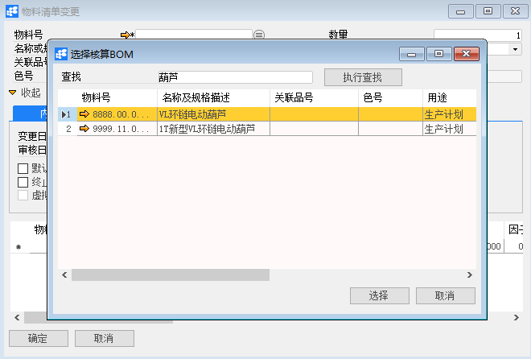
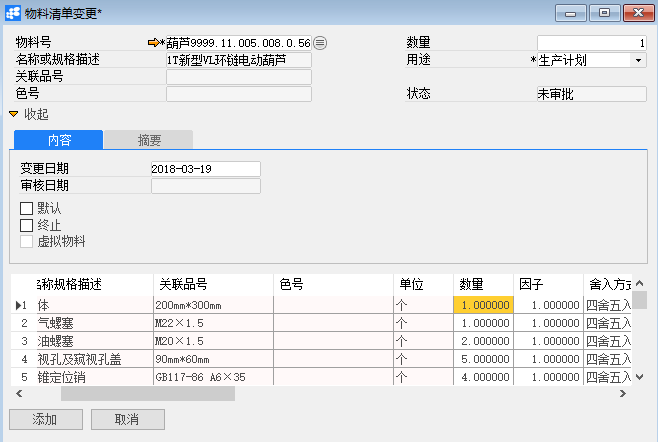
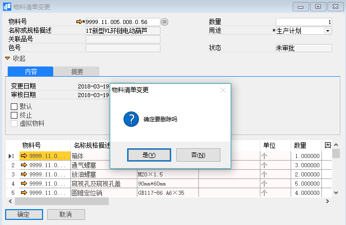

# 变更物料清单

## 功能解释

运用此功能可以对已审批通过的物料清单进行修改。

## 文章主旨

本文介绍如何通过BAP Nicer 5完成变更物料清单的新增、修改及删除操作。

## 操作要求

当前登陆用户拥有操作变更物料清单业务的权限，权限设置请在帮助文档中搜索查看。

## 新增变更物料清单

1. 从系统菜单->【计划】->【变更物料清单】，打开定义界面；

2. 点击工具栏新空白按钮准备新增变更物料清单；

3. 选择新增变更物料清单的物料号以及用途；

   

   

   | 扩展操作介绍                                                 |
   | ------------------------------------------------------------ |
   | 选择物料号时可以直接在变更物料清单的“物料号”栏位中输入物料名称关键字或编号关键字，再点击电脑键盘的Enter键执行查找。 |

4. 修改物料清单内容或终止物料清单；

5. 在【摘要】选项卡下对版本进行维护；

6. 信息确认无误后点击【添加】或工具栏的保存按钮，保存变更物料清单。

   

   | 提醒                                                         |
   | ------------------------------------------------------------ |
   | 系统未配置自动发起审批时，保存订单信息检查无误后需要点击工具栏的发起审批按钮，执行请求审批操作 |

## 修改变更物料清单

1. 从系统菜单->【计划】->【变更物料清单】，打开变更物料清单界面；

2. 点击工具栏的浏览按钮，查找要修改的变更物料清单；

3. 修改变更物料清单的内容；

4. 点击【更改】或工具栏的保存按钮保存，更改变更物料清单。

注：已审批通过的变更物料清单不能进行修改。

## 删除变更物料清单

1. 从系统菜单->【计划】->【变更物料清单】，打开定义界面；

2. 点击工具栏的浏览按钮，查找要删除的变更物料清单；

3. 点击工具栏的按钮，进行删除操作。

注：已审批通过的变更物料清单不能进行删除。

## 属性与活动描述

| **属性**       | **活动描述**                                 |
| -------------- | -------------------------------------------- |
| 物料号         | 选择上级物料号                               |
| 名称及规格描述 | 显示物料描述                                 |
| 关联品号       | 显示物料关联品号                             |
| 色号           | 显示物料色号                                 |
| 数量           | 输入物料清单配比数量                         |
| 用途           | 选择物料清单用途：生产计划、库存、销售、估算 |
| 变更日期       | 输入变更日期                                 |
| 审核日期       | 显示单据的审核日期                           |
| 状态           | 显示单据状态                                 |
| 默认           | 勾选是否为默认                               |
| 终止           | 勾选是否终止                                 |
| 虚拟物料       | 勾选是否为虚拟物料                           |

## 内容

| **属性**       | **活动描述**                                                 |
| -------------- | ------------------------------------------------------------ |
| 物料号         | 选择组件物料号                                               |
| 名称及规格描述 | 显示物料描述                                                 |
| 关联品号       | 显示物料关联品号                                             |
| 色号           | 显示物料色号                                                 |
| 单位           | 显示物料库存单位                                             |
| 数量           | 输入物料清单配比数量                                         |
| 因子           | 输入物料因子                                                 |
| 舍入方式       | 选择数量舍入方式                                             |
| 备选替代组     | 选择备选替代组                                               |
| 替代度         | 显示替代度                                                   |
| 虚拟物料       | 选择是否作为虚拟物料                                         |
| 发货方式       | 选择发货方式：倒冲 -- 只要报告了上级物料的完成情况，就自动将下级物料发送到生产订单。 手动 -- 手动将下级物料发送到生产订单 |
| 特殊库存       | 选择物料特殊库存维度                                         |
| 特殊库存数量   | 选择物料特殊库存数量                                         |
| 数量公示       | 输入数量公示                                                 |
| 长度公示       | 输入长度公示                                                 |
| 宽度公示       | 输入宽度公示                                                 |
| 高度公示       | 输入高度公示                                                 |
| 重量公示       | 输入重量公示                                                 |
| 有效期从、到   | 输入物料清单的有效期范围                                     |

## 摘要

| **属性** | **活动描述**         |
| -------- | -------------------- |
| 创建人   | 显示单据的创建人     |
| 版本     | 输入物料清单的版本号 |
| 版本说明 | 输入版本说明         |