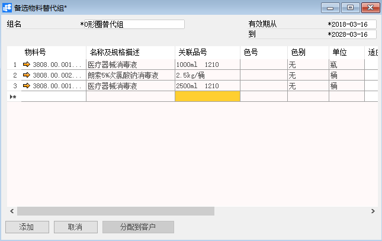
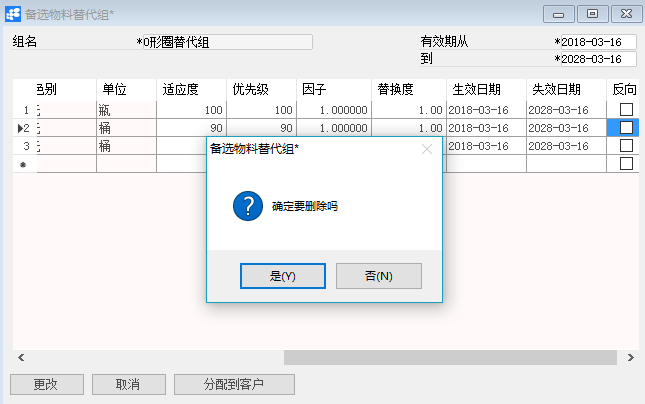

# 定义备选物料替代组

## 功能解释

当仓库没有特定的物料，但可以用其他物料来替代，我们可以在系统中维护备选物料替代组来保证订单的流转，为后期的MRP运算做好了考虑。

## 文章主旨

本文介绍如何通过BAP Nicer 5完成定义备选物料替代组的新增、修改及删除操作。

## 操作要求

当前登陆用户拥有操作定义备选物料替代组业务的权限，权限设置请在帮助文档中搜索查看。

## 新增备选物料替代组

1. 从菜单窗口，【计划】->【定义】->【定义备选物料替代组】，打开创建界面；

2. 点击工具栏新空白按钮准备新增定义备选物料替代组；

3. 编辑组名、有效期；

4. 在下方编辑备选物料替代组的信息，如物料、优先级、有效期等信息；

5. 点击【添加】保存。

   

## 修改备选物料替代组

1.  从菜单窗口，【计划】->【定义】->【定义备选物料替代组】，打开创建界面；
2.  点击工具栏的浏览按钮，查找要修改的备选物料替代组；
3.  修改备选物料替代组的内容；
4.  点击【更改】或工具栏的保存按钮 保存，更改备选物料替代组。

## 删除备选物料替代组

1.  从菜单窗口，【计划】->【定义】->【定义备选物料替代组】，打开创建界面；

2. 点击工具栏的浏览按钮，查找要删除的备选物料替代组；

3. 点击工具栏的按钮，进行删除操作。

   

## 属性与活动描述

| **属性**     | **活动描述**               |
| ------------ | -------------------------- |
| 组号         | 输入备选物料替代组的组名称 |
| 有效期从、到 | 输入替代组的有效日期范围   |

## 明细

| **属性**           | **活动描述**               |
| ------------------ | -------------------------- |
| 物料号             | 选择物料号                 |
| 名称及规格描述     | 显示物料描述               |
| 关联品号           | 显示物料关联品号           |
| 色号               | 显示物料色号               |
| 单位               | 显示物料库存单位           |
| 适应度             | 输入物料的适应度           |
| 优先级             | 输入物料的优先级           |
| 因子               | 输入物料的因子             |
| 替代度             | 输入物料的替代组           |
| 生效日期、失效日期 | 输入物料的有效日期范围     |
| 反向               | 选择物料的替代是否反向生效 |

