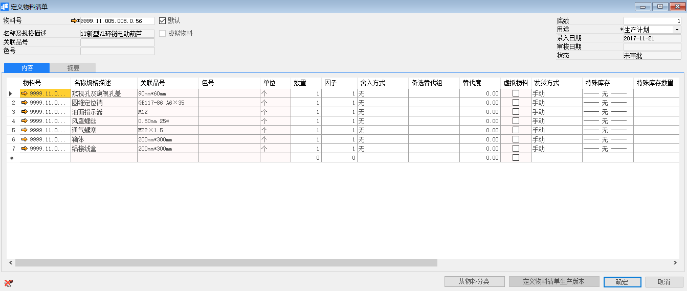
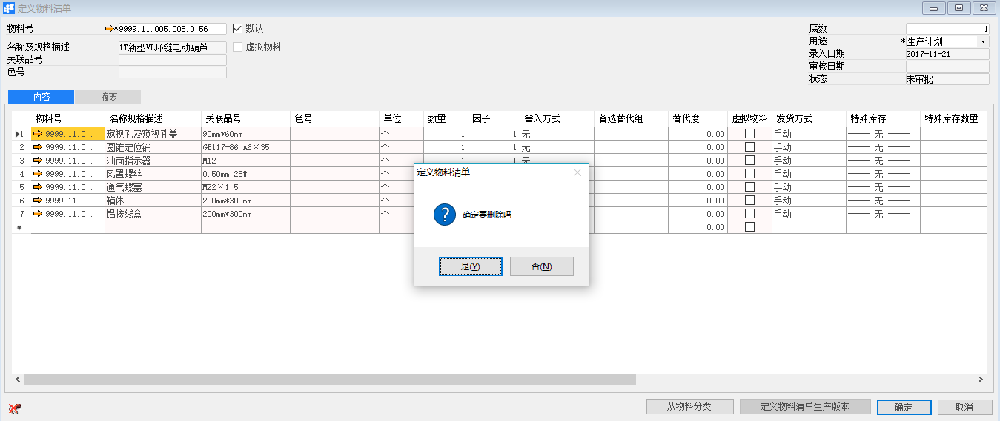

# 定义或更新物料清单

## 功能解释

物料清单（Bill Of Material 简称BOM）是[MRP](http://wiki.mbalib.com/wiki/MRP)的重要文件，几乎所有的管理部门都要到它。是详细记录一个项目所用到的所有下阶材料及相关属性，亦即，母件与所有子件的从属关系、单位用量及其他属性.在有些系统称为材料表或配方料表。在[ERP](http://wiki.mbalib.com/wiki/ERP)系统要正确地计算出物料需求数量和时间，必须有一个准确而完整的产品结构表，来反映生产产品与其组件的数量和从属关系。在所有数据中，物料清单的影响面最大，对它的准确性要求也相当高。

BOM包括的信息有：物料的结构层次、物料编号、物料名称、规格、计量单位、数量此外还标注有效期(生效期/失效期)。

此功能可以定义或更新物料清单。

## 文章主旨

本文介绍如何通过BAP Nicer 5完成定义或更新物料清单的新增、修改及删除操作。

## 操作要求

当前登陆用户拥有操作定义或更新物料清单业务的权限，权限设置请在帮助文档中搜索查看。

## 新增物料清单

1.  从菜单窗口，【计划】->【定义】->【定义物料清单】，打开创建界面；

2. 点击工具栏新空白按钮准备新增定义物料清单；

3. 编辑物料、底数、用途等基础信息；

4. 在【内容】选项卡下编辑组成该物料的下级物料；

5. 编辑从属物料的信息：数量、因子、输入方式等信息；

6. 点击【添加】保存。

   

| 提醒                                                         |
| ------------------------------------------------------------ |
| 系统未配置自动发起审批时，保存订单信息检查无误后需要点击工具栏的发起审批按钮，执行请求审批操作 |

## 修改物料清单

1. 从菜单窗口，【计划】->【定义】->【定义物料清单】，打开创建界面；

2. 点击工具栏的浏览按钮，查找要修改的物料清单；

3. 修改物料清单的内容；

4. 点击【更改】或工具栏的保存按钮保存，更改物料清单。

注：已审批通过的物料清单不能进行修改。

## 删除物料清单

1. 从菜单窗口，【计划】->【定义】->【定义物料清单】，打开创建界面；

2. 点击工具栏的浏览按钮，查找要删除的物料清单；

3. 点击工具栏的按钮，进行删除操作。

   

## 属性与活动描述

| **属性**       | **活动描述**                                 |
| -------------- | -------------------------------------------- |
| 物料号         | 选择上级物料号                               |
| 名称及规格描述 | 显示物料描述                                 |
| 关联品号       | 显示物料关联品号                             |
| 色号           | 显示物料色号                                 |
| 底数           | 输入物料清单配比数量                         |
| 用途           | 选择物料清单用途：生产计划、库存、销售、估算 |
| 录入日期       | 输入创建日期                                 |
| 审核日期       | 显示单据的审核日期                           |
| 状态           | 显示单据状态                                 |

## 内容

| **属性**       | **活动描述**                                                 |
| -------------- | ------------------------------------------------------------ |
| 物料号         | 选择组件物料号                                               |
| 名称及规格描述 | 显示物料描述                                                 |
| 关联品号       | 显示物料关联品号                                             |
| 色号           | 显示物料色号                                                 |
| 单位           | 显示物料库存单位                                             |
| 数量           | 输入物料清单配比数量                                         |
| 因子           | 输入物料因子                                                 |
| 舍入方式       | 选择数量舍入方式                                             |
| 备选替代组     | 选择备选替代组                                               |
| 替代度         | 显示替代度                                                   |
| 虚拟物料       | 选择是否作为虚拟物料                                         |
| 发货方式       | 选择发货方式：倒冲 -- 只要报告了上级物料的完成情况，就自动将下级物料发送到生产订单。 手动 --手动将下级物料发送到生产订单 |
| 特殊库存       | 选择物料特殊库存维度                                         |
| 特殊库存数量   | 选择物料特殊库存数量                                         |
| 数量公示       | 输入数量公示                                                 |
| 长度公示       | 输入长度公示                                                 |
| 宽度公示       | 输入宽度公示                                                 |
| 高度公示       | 输入高度公示                                                 |
| 重量公示       | 输入重量公示                                                 |
| 有效期从、到   | 输入物料清单的有效期范围                                     |

## 摘要

| **属性** | **活动描述**         |
| -------- | -------------------- |
| 创建人   | 显示单据的创建人     |
| 版本     | 输入物料清单的版本号 |
| 版本说明 | 输入版本说明         |