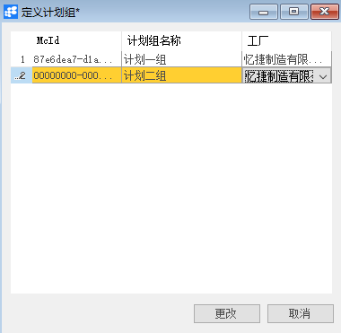
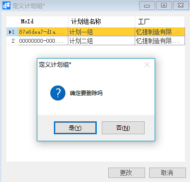

# 定义计划组

## 功能解释

此功能可以定义计划模块所用的计划组。

## 文章主旨

本文介绍如何通过BAP Nicer 5完成定义计划组的新增、修改及删除操作。

## 操作要求

当前登陆用户拥有操作定义计划组业务的权限，权限设置请在帮助文档中搜索查看。

## 新增计划组

1. 从菜单窗口，【计划】->【定义】->【定义计划组】，打开创建界面；

2. 编辑计划组名称、选择计划组所属工厂；

3. 点击【更改】保存。

   

## 修改计划组

1. 从菜单窗口，【计划】->【定义】->【定义计划组】，打开创建界面；
2. 修改计划组的内容；
3. 点击【更改】或工具栏的保存按钮保存，更改计划组。

## 删除计划组

1. 从菜单窗口，【计划】->【定义】->【定义计划组】，打开创建界面；

2. 选中需要删除的那一行；

3. 点击工具栏的按钮，进行删除操作。

   

## 属性与活动描述

| **属性**   | **活动描述**         |
| ---------- | -------------------- |
| 计划组名称 | 输入计划组的名称     |
| 工厂       | 输入计划组所属的工厂 |