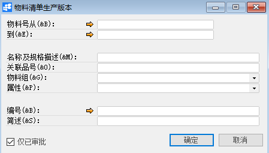
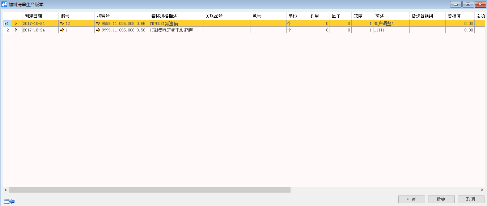

# 查找物料清单生产版本

## 功能解释

运用此功能可以查找物料清单生产版本。

## 文章主旨

本文介绍如何通过BAP Nicer 5完成查找物料清单生产版本操作。

## 操作要求

当前登陆用户拥有操作查找物料清单生产版本的权限，权限设置请在帮助文档中搜索查看。

## 查找物料清单生产版本

1. 从系统菜单->【计划】->【定义】->【查找物料清单生产版本】，打开定义界面；

2. 填写查询关键信息；

   

3. 点击【确定】进入结果界面。

   

## 物料清单生产版本查询窗口数据

| **属性**       | **活动描述**       |
| -------------- | ------------------ |
| 物料号从…到    | 输入物料号从…到    |
| 名称及规格描述 | 输入名称及规格描述 |
| 关联品号       | 显示关联品号       |
| 物料组         | 选择物料组         |
| 属性           | 选择属性           |
| 编号           | 显示编号           |
| 简述           | 显示简述           |
| 仅已审批       | 勾选是否仅已审批   |

## 查找物料清单生产版本信息

| **属性**     | **活动描述**     |
| ------------ | ---------------- |
| 创建日期     | 显示创建日期     |
| 编号         | 显示编号         |
| 物料号       | 显示物料号       |
| 名称规格描述 | 显示名称规格描述 |
| 关联品号     | 显示关联品号     |
| 色号         | 显示色号         |
| 单位         | 显示单位         |
| 数量         | 显示数量         |
| 因子         | 显示因子         |
| 深度         | 显示深度         |
| 简述         | 显示简述         |
| 备选替换组   | 显示备选替换组   |
| 替换度       | 显示替换度       |
| 发货方式     | 显示发货方式     |
| 仓库         | 显示仓库         |
| 特殊库存     | 显示特殊库存     |
| 数量公式     | 显示数量公式     |
| 长度公式     | 显示长度公式     |
| 宽度公式     | 显示宽度公式     |
| 高度公式     | 显示高度公式     |
| 重量公式     | 显示重量公式     |
| 工艺路线     | 显示工艺路线     |

