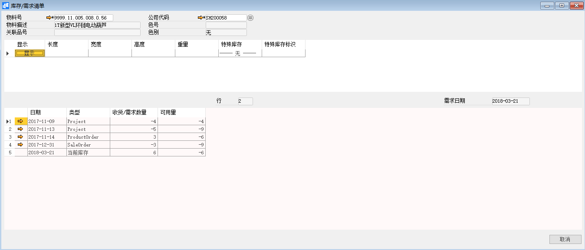

# 库存需求清单

## 功能解释

运用此功能可查看物料因采购、生产和销售业务的发生，在未来一段时间内预计出入库的数量和凭证类型。

## 文章主旨

本文介绍如何通过BAP Nicer 5完成库存需求清单查询操作。

## 操作要求

当前登陆用户拥有操作库存需求清单的权限，权限设置请在帮助文档中搜索查看。

## 查询库存需求清单

1. 从菜单窗口，【计划】->【库存/需求清单】，打开清单界面；

2. 输入要查看清单的物料号，点击回车键即可得出查询结果；

3. 在结果中查看库存/需求明细。

   

## 属性与活动描述

| **属性**      | **活动描述**                                         |
| ------------- | ---------------------------------------------------- |
| 物料号        | 选择物料号                                           |
| 物料描述      | 显示物料描述                                         |
| 公司代码      | 显示公司代码                                         |
| 关联品号      | 显示物料关联品号                                     |
| 色别          | 显示色别                                             |
| 色号          | 显示色号                                             |
| 长度          | 显示物料长度，是物料维度之一                         |
| 宽度          | 显示物料宽度，是物料维度之一                         |
| 高度          | 显示物料高度，是物料维度之一                         |
| 重量          | 显示物料重量，是物料维度之一                         |
| 特殊库存      | 显示特殊库存，是物料维度之一                         |
| 特殊库存标识  | 显示特殊库存标识，是物料维度之一                     |
| 日期          | 显示日期                                             |
| 类型          | 显示物料库存/需求类型                                |
| 收货/需求数量 | 显示物料需求数量，正数表示入库数量，负数表示出库数量 |
| 可用量        | 显示库存可用量                                       |