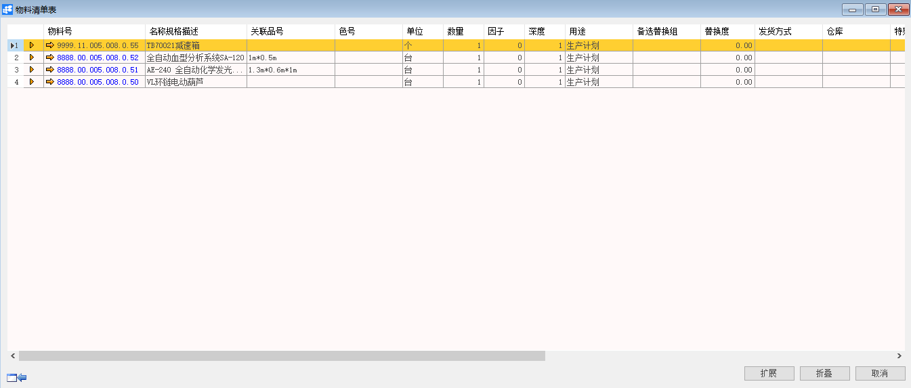

# 物料清单表

## 功能解释

运用此功能可以来查看物料清单的明细，以报表清单的形式查看物料的层次结构。

## 文章主旨

本文介绍如何通过BAP Nicer 5完成物料清单表查询操作。

## 操作要求

当前登陆用户拥有操作物料清单表的权限，权限设置请在帮助文档中搜索查看。

## 查询物料清单表

1. 从系统菜单->【计划】->【物料清单表】，打开定义界面；

2. 填写查询关键信息；

   

3. 点击【确定】进入结果界面。

   

## 物料清单表查询窗口数据

| **属性**       | **活动描述**                 |
| -------------- | ---------------------------- |
| 物料号从、到   | 选择物料号范围               |
| 名称及规格描述 | 输入物料描述作为筛选条件     |
| 关联品号       | 输入物料关联品号做为选择条件 |
| 物料组         | 输入物料组作为选择条件       |
| 属性           | 输入物料属性作为选择条件     |
| 方向           | 输入方向作为选择条件         |
| 用途           | 输入物料清单用途作为选择条件 |
| 客户相关       | 输入客户作为选择条件         |
| 显示全部       | 选择忽略所以筛选条件         |

## 物料清单表明细信息

| **属性**       | **活动描述**             |
| -------------- | ------------------------ |
| 物料号         | 显示物料号               |
| 名称及规格描述 | 显示物料描述             |
| 关联品号       | 显示物料关联品号         |
| 色号           | 显示物料色号             |
| 单位           | 显示物料库存单位         |
| 数量           | 显示物料清单配比数量     |
| 因子           | 显示物料因子             |
| 深度           | 显示物料清单层次深度     |
| 用途           | 显示物料清单用途类别     |
| 备选替代组     | 显示备选替代组           |
| 替代度         | 显示替代度               |
| 发货方式       | 显示发货方式             |
| 仓库           | 显示发货仓库             |
| 特殊库存       | 显示物料特殊库存维度     |
| 数量公示       | 显示数量公示             |
| 长度公示       | 显示长度公示             |
| 宽度公示       | 显示宽度公示             |
| 高度公示       | 显示高度公示             |
| 重量公示       | 显示重量公示             |
| 版本号         | 显示物料清单的版本号     |
| 版本说明       | 显示版本说明             |
| 所以版本       | 显示物料清单的所以版本   |
| 扩展           | 点击物料清单全部展开显示 |
| 折叠           | 点击物料清单全部折叠显示 |