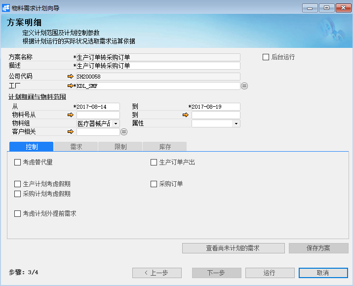

# 物料需求计划运算

## 功能解释

物料需求计划运算又称MRP预算，能够对生产或采购流程中的物料需求进行计划。

MRP运行的结果是提出物料的生产或采购建议，通过考虑现有库存水平以及现有采购和生产订单等来实现总需求。

按照已定义的计划提前期对建议进行倒计时计划，以达到其自有组件的需求日期。

## 文章主旨

本文介绍如何通过BAP Nicer 5完成物料需求计划运算，新增、删除操作。

## 操作要求

当前登陆用户拥有操作物料需求计划运算的权限，权限设置请在帮助文档中搜索查看。

## 物料需求计划运算

1. 从菜单窗口，【计划】->【物料需求计划运算】，打开运算界面；

2. 选择需要进行MRP运算的公司；

3. 点击【下一步】，选择创建新方案还是从已有方案中选择；

4. 点击【下一步】，编辑MRP运算方案明细，以及选择MRP运算范围；

   

5. 点击【运行】，进行计算；

6. 点击【保存结果】将运算结果保存到系统中。

注：① 保存方案：将此次编辑的方案保存至系统，供下次使用；

​	② 查看推荐：点击该按钮，可以显示运算结果是推荐转换为采购订单还是生产订单；

​	③ 全部展开：可以展开运算结果明细。

## 删除物料需求计划运算

1. 从菜单窗口，【计划】->【物料需求计划运算】，打开运算界面；
2. 选择需要删除的物料需求计划运算方案；
3. 点击【删除方案】按钮，进行删除。

## 属性与活动描述

### 步骤1

| **属性** | **活动描述**    |
| -------- | --------------- |
| 公司代码 | 选择公司代码    |
| 上一步   | 点击返回上一步  |
| 下一步   | 点击进入下一步  |
| 运行     | 点击进行MRP运算 |

### 步骤2

| **属性**         | **活动描述**     |
| ---------------- | ---------------- |
| 创建新方案       | 选择创建新方案   |
| 选择已存在的方案 | 选择已存在的方案 |
| 方案名称         | 显示方案名称     |
| 描述             | 显示方案描述     |
| 起始日           | 显示方案起始日期 |
| 结束日           | 显示方案结束日期 |
| 公司代码         | 显示公司代码     |
| 删除方案         | 点击删除选定方案 |
| 上一步           | 点击返回上一步   |
| 下一步           | 点击进入下一步   |
| 运行             | 点击进行MRP运算  |

### 步骤3 方案明细

| **属性**               | **活动描述**                                                 |
| ---------------------- | ------------------------------------------------------------ |
| 方案名称               | 输入方案名称                                                 |
| 描述                   | 输入方案描述                                                 |
| 工厂                   | 选择工厂                                                     |
| 公司代码               | 输入或显示公司代码                                           |
| 从、到                 | 输入方案起始日期、结束日期                                   |
| 物料号从、到           | 选择需进行MRP运算的物料号范围                                |
| 物料组                 | 选择需进行MRP运算的物料组                                    |
| 属性                   | 选择需进行MRP运算的物料属性                                  |
| 客户相关               | 选择需进行MRP运算的客户信息                                  |
| 考虑计划外提前需求、天 | 定义是否将N天后的相关需求量纳入计算（N为自定义天数）         |
| 生产计划考虑假期       | 选择生产计划是否将假期纳入运算，假期的天数增加了MRP计算的提前期间隔 |
| 考虑替代量             | 选择是否考虑替代量纳入运算                                   |
| 采购计划考虑假期       | 选择采购计划是否将假期纳入运算，假期的天数增加了MRP计算的提前期间隔 |
| 当前库存               | 选择当前库存将出现仓库列表，选择仓库库存量做为MRP计算信息    |
| 安全库存               | 选择是否将安全库存纳入MRP运算                                |
| 销售预测需求           | 选择本字段将定义为纳入MRP运算的销售预测需求包括在 MRP计算中  |
| 销售订单需求           | 选择本字段将未清销售订单包括在MRP计算中                      |
| 生产订单需求           | 选择本字段将未清生产订单需求包括在MRP计算中                  |
| 预留需求               | 选择本字段将物料预留单包括在MRP计算中                        |
| 公司间采购需求         | 选择本字段将公司间需求单包括在MRP计算中                      |
| 生产订单产出           | 选择本字段将未清生产订单产出包括在MRP计算中，可选择是否包括未下达行 |
| 采购订单               | 选择本字段将未清采购订单包括在 MRP 计算中，可选择是否包括未下达行 |
| 保存方案               | 点击保存当前方案                                             |
| 上一步                 | 点击返回上一步                                               |
| 下一步                 | 点击进入下一步                                               |
| 运行                   | 点击进行MRP运算                                              |

### 步骤4 计划结果

| **属性**                     | **活动描述**                                                 |
| ---------------------------- | ------------------------------------------------------------ |
| 查找                         | 输入内容查找物料高亮显示                                     |
| 阶次                         | 选择阶次，单阶：只显示查询的父项或子项；多阶：显示相关的父项和子项；尾阶：显示查询的未项。 |
| 方向                         | 选择方向，正向：显示父项包含的子项；反向：按子项显示关联的父项 |
| 排序                         | 按BOM顺序：物料按BOM顺序排序按物料号：物料按物料号顺序排序按物料组；物料按物料组排序 |
| 代码/细节                    | 选择是否显示物料细节                                         |
| 隐藏无计划投产（采购）量的行 | 选择是否隐藏无计划投产（采购）量的行                         |
| 隐藏未选中的行               | 选择是否隐藏未选中的行                                       |
| 全部展开                     | 点击全部展开物料详细需求信息列表                             |
| 全部收起                     | 点击全部折叠物料详细需求信息列表                             |
| 查看推荐                     | 点击查看推荐结果                                             |
| 保存结果                     | 点击保存结果到生产或采购建议                                 |
| 保存方案                     | 点击保存当前方案                                             |
| 上一步                       | 点击返回上一步                                               |
| 完成                         | 点击完成关闭界面                                             |
| 运行                         | 点击进行MRP运算                                              |

## 计划结果明细

| **属性**     | **活动描述**              |
| ------------ | ------------------------- |
| 物料号       | 显示物料号                |
| 名称规格描述 | 显示物料描述              |
| 关联品号     | 显示物料关联品号          |
| 在库量       | 显示物料在库数量          |
| 预计接收量   | 显示MRP运算结果预计接收量 |
| 已承诺量     | 显示MRP运算结果已承诺量   |

## 计划结果推荐明细

| **属性**     | **活动描述**                     |
| ------------ | -------------------------------- |
| 订单类型     | 显示运算结果推荐的订单类型       |
| 物料号       | 显示物料号                       |
| 名称规格描述 | 显示物料描述                     |
| 色别         | 显示物料色别                     |
| 单位         | 显示物料单位                     |
| 预计接收量   | 显示MRP运算结果预计接收量        |
| 已承诺量     | 显示MRP运算结果已承诺量          |
| 长度         | 显示物料长度，是物料维度之一     |
| 宽度         | 显示物料宽度，是物料维度之一     |
| 高度         | 显示物料高度，是物料维度之一     |
| 重量         | 显示物料重量，是物料维度之一     |
| 特殊库存     | 显示特殊库存，是物料维度之一     |
| 特殊库存标识 | 显示特殊库存标识，是物料维度之一 |
| 体积         | 显示物料的体积                   |
| 体积单位     | 显示物料的体积单位               |
| 投产日       | 显示物料投产日                   |
| 计划量       | 显示物料的计划量                 |
| 供应商编号   | 显示物料采购的供应商编号         |
| 供应商名称   | 显示供应商名称                   |