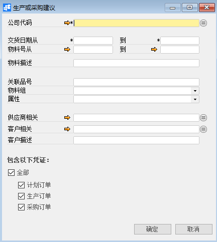
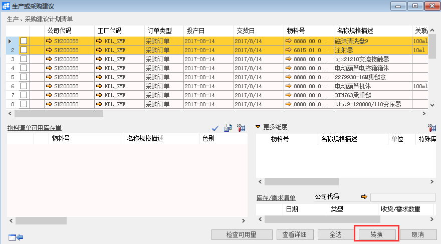

# 生产或采购建议

## 功能解释

运用此功能可以根据MRP运行的结果可以给出物料的生产或采购建议。使用此窗口，可将MRP运行的结果转换成生产订单或采购申请单/采购订单。

## 文章主旨

本文介绍如何通过BAP Nicer 5完成生产或采购建议查询及生产订单或采购申请单/采购订单转换操作。

## 操作要求

当前登陆用户拥有操作生产或采购建议的权限，权限设置请在帮助文档中搜索查看。

## 生产或采购建议

1. 从菜单窗口，【计划】->【生产或采购建议】，打开条件窗口；

2. 编辑需要进行转换的运算结果的条件；   

         

3. 点击【确定】进行建议列表；

4. 选中所需转换的复选框不同的订单类型需分开转换，点击【转换】，其中不同的订单类型需分开转换；

5. 跳出确定框，点击【是】，进入转换界面；

6. 生产订单转换：生产可以转换成自制的生产订单和委外的生产订单，然后维护相应的信息；

7. 采购订单转换：采购订单可以转换成采购申请和采购建议，然后维护相应的信息；

8. 点击【确定】完成转换。

   

## 属性与活动描述

| **属性**       | **活动描述**                 |
| -------------- | ---------------------------- |
| 公司代码       | 选择公司代码                 |
| 交货日期从、到 | 选择交货日期范围             |
| 物料号从、到   | 选择物料号范围               |
| 物料描述       | 输入物料描述作为筛选条件     |
| 关联品号       | 输入物料关联品号做为选择条件 |
| 物料组         | 输入物料组作为选择条件       |
| 属性           | 输入物料属性作为选择条件     |
| 供应商相关     | 输入供应商作为选择条件       |
| 客户相关       | 输入客户作为选择条件         |
| 客户描述       | 输入客户描述                 |

## 明细

| **属性**       | **活动描述**                                 |
| -------------- | -------------------------------------------- |
| 公司代码       | 显示公司代码                                 |
| 工厂代码       | 显示工厂代码                                 |
| 订单类型       | 显示订单类型                                 |
| 投产日         | 显示投产日                                   |
| 交货日         | 显示交货日                                   |
| 物料号         | 显示物料号                                   |
| 名称及规格描述 | 显示物料描述                                 |
| 关联品号       | 显示物料关联品号                             |
| 色号           | 显示物料色号                                 |
| 色别           | 显示色别                                     |
| 单位           | 显示物料库存单位                             |
| 长度           | 显示物料长度，是物料维度之一                 |
| 宽度           | 显示物料宽度，是物料维度之一                 |
| 高度           | 显示物料高度，是物料维度之一                 |
| 重量           | 显示物料重量，是物料维度之一                 |
| 特殊库存       | 显示特殊库存，是物料维度之一                 |
| 特殊库存标识   | 显示特殊库存标识，是物料维度之一             |
| 计划量         | 显示物料的计划量                             |
| 已转数量       | 显示已转数量                                 |
| 本次转换数量   | 显示本次转换数量                             |
| 客户号         | 显示客户号                                   |
| 客户描述       | 显示客户描述                                 |
| 项目号         | 显示项目号                                   |
| 供应商编号     | 显示物料采购的供应商编号                     |
| 供应商名称     | 显示供应商名称                               |
| 生产版本       | 显示生产版本                                 |
| 计划方案       | 显示计划方案                                 |
| 需求时间从…到  | 显示需求时间从…到                            |
| 运行时间从…到  | 显示运行时间从…到                            |
| 运行人         | 显示运行人                                   |
| 来源类型       | 显示来源类型                                 |
| 来源单据       | 显示来源单据                                 |
| 物料权限组     | 显示物料权限组                               |
| 物料组         | 显示物料组                                   |
| 查看详细       | 点击查看生产的建议明细                       |
| 全选           | 点击全选单据                                 |
| 转换           | 点击将建议转换成生产订单、采购订单、采购申请 |