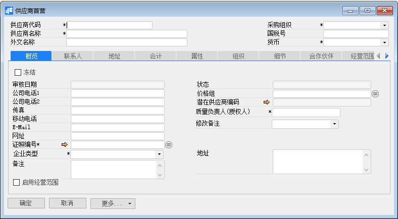
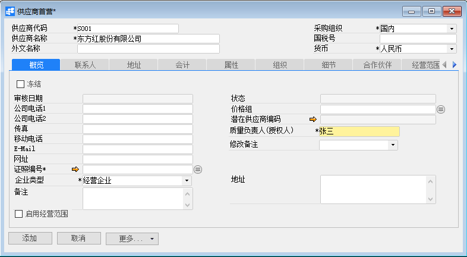
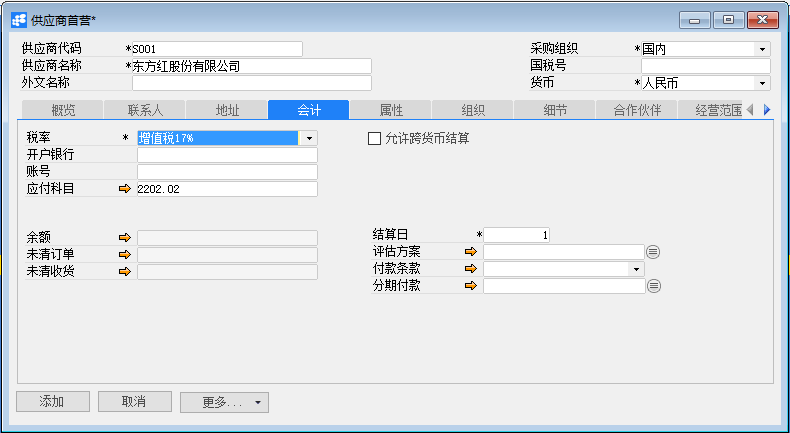
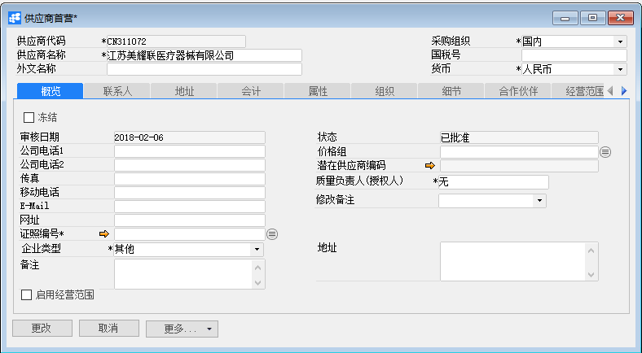
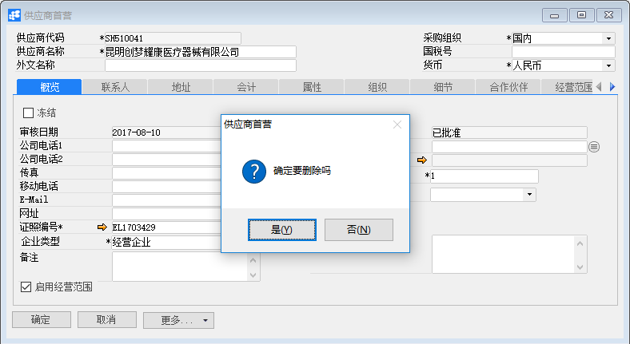

# 供应商主数据

## 功能解释

《零售商供应商公平交易管理办法》规定：供应商是指直接向零售商提供商品及相应服务的企业及其分支机构、个体工商户，包括制造商、经销商和其他中介商。我们可以在系统中对供应商信息进行维护，以方便对供应商的管理与使用。

## 文章主旨

本文介绍如何通过BAP Nicer 5完成供应商主数据的新增、修改及删除操作。

## 操作要求

当前登陆用户拥有操作供应商主数据业务的权限，权限设置请在帮助文档中搜索查看。

## 新增供应商主数据

1. 从菜单栏【采购】->【供应商主数据】,打开供应商主数据窗口；

   

2. 编辑供应商代码、名称、采购组、货币等信息；

   

3. 在各个选项卡下对供应商详细信息进行编辑；

   

4. 点击【添加】保存；

## 修改供应商主数据

1. 从系统菜单【采购】->【供应商主数据】，打开供应商主数据界面；

2. 点击工具栏的查询按钮，查找需要修改的供应商主数据，修改必要的数据；

   

3. 点击【更改】按钮，状态栏显示“更改已保存！”信息，表示修改供应商主数据成功；

4. 点击工具栏按钮，发起审批。

## 删除供应商主数据

1. 从系统菜单【采购】->【供应商主数据】,打开供应商主数据窗口；

2. 点击工具栏的浏览按钮，查找要删除的供应商主数据；

3. 点击工具栏的删除按钮，系统会提示删除确认。系统会提示确定要删除吗？点击【是】按钮，状态栏显示记录已删除，删除供应商主数据成功。

   

## 属性与活动描述

| 属性     | 活动描述                 |
| -------- | ------------------------ |
| 代码     | 输入供应商代码           |
| 名称     | 输入供应商名称           |
| 外文名称 | 输入供应商的外文名称     |
| 采购组织 | 选择供应商所属的采购组织 |
| 国税号   | 输入供应商的国税号       |
| 货币     | 输入供应商的默认交易货币 |

## 概览

| 属性               | 活动描述                                                     |
| ------------------ | ------------------------------------------------------------ |
| 冻结、从、到、备注 | 设置供应商的冻结日期范围，该范围内无法进行该供应商的业务活动 |
| 公司电话1          | 输入供应商的公司电话                                         |
| 公司电话2          | 输入供应商的公司电话                                         |
| 传真               | 输入供应商的传真                                             |
| 移动电话           | 输入供应商的移动电话                                         |
| E-Mail             | 输入供应商的电子邮箱                                         |
| 网址               | 输入供应商的网址                                             |
| 备注               | 输入联系人的备注信息                                         |
| 主要联系人         | 显示供应商的默认联系人                                       |

## 联系人

| 属性           | 活动描述               |
| -------------- | ---------------------- |
| 姓名           | 输入供应商的联系人姓名 |
| 称谓           | 输入联系人的称谓       |
| 地址           | 输入联系人的地址       |
| 电话1          | 输入联系人的电话       |
| 电话           | 输入联系人的电话       |
| 移动电话       | 输入联系人的移动电话   |
| 传真           | 输入联系人的传真       |
| E-Mail         | 输入联系人的电子邮箱   |
| 备注           | 输入联系人的备注信息   |
| 设为默认联系人 | 设置选定人为默认联系人 |

## 地址

| **属性**     | **活动描述**           |
| ------------ | ---------------------- |
| 名称         | 输入地址名称           |
| 邮政编码     | 输入邮政编码           |
| 街道         | 输入地址的街道信息     |
| 地区         | 输入地址的地区         |
| 城市         | 输入地址的城市         |
| 省           | 输入地址的省份         |
| 国家         | 输入地址的国家         |
| 国税号       | 输入国税号             |
| 备注         | 输入地址的备注信息     |
| 开盘到       | 选择地址类型为开票地址 |
| 发运到       | 选择地址类型为发运地址 |
| 设为默认地址 | 设置选定地址为默认地址 |

## 会计

| **属性** | **活动描述**             |
| -------- | ------------------------ |
| 税率     | 选择供应商的默认税率     |
| 开户银行 | 输入开户银行             |
| 结算日   | 输入供应商的默认结算日   |
| 账号     | 输入供应商的银行账号信息 |
| 应付科目 | 选择供应商的缺省往来科目 |

## 库存

| **属性** | **活动描述**                             |
| -------- | ---------------------------------------- |
| 属性名称 | 显示供应商属性列表，选择供应商具有的属性 |
| 全选     | 点击全选属性                             |
| 撤销全选 | 点击属性全部不选择                       |

## 关联组织

| **属性** | **活动描述**                                   |
| -------- | ---------------------------------------------- |
| 公司代码 | 选择供应商所属的组织，应用于集团内部供应商设置 |
| 工厂     | 选择工厂                                       |

## 细节

| **属性**   | **活动描述**                         |
| ---------- | ------------------------------------ |
| 从磁盘选择 | 点击从磁盘选择供应商的图片或其他信息 |
| 移除       | 点击移除供应商的信息                 |