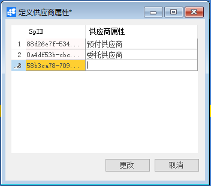
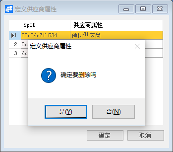

# 定义供应商属性

## 功能解释

使用此窗口可以定义系统中的供应商所具有的属性。

## 文章主旨

本文介绍如何通过BAP Nicer 5完成定义供应商属性的新增、修改及删除操作。

## 操作要求

当前登陆用户拥有操作定义供应商属性业务的权限，权限设置请在帮助文档中搜索查看。

## 新增定义供应商属性

1. 从菜单栏【模块】->【采购】->【定义】->【定义供应商属性】,打开定义供应商属性窗口；

2. 在供应商属性名称列中输入供应商属性；

   

3. 点击【更改】按钮，状态栏显示“更改已保存！”信息，表示创建定义供应商属性成功；

## 修改供应商属性

1. 从菜单栏【模块】->【采购】->【定义】->【定义供应商属性】，打开定义供应商属性界面；

2. 查找需要修改的定义供应商属性，修改必要的数据；

   

3. 点击【更改】按钮，状态栏显示“更改已保存！”信息，表示修改定义供应商属性成功；

## 删除定义供应商属性

1. 从菜单栏【模块】->【采购】->【定义】->【定义供应商属性】,打开定义供应商属性窗口；

2. 查找要删除的定义供应商属性；

3. 点击工具栏的删除按钮，系统会提示删除确认。系统会提示确定要删除吗？点击【是】按钮，状态栏显示记录已删除，删除定义供应商属性成功。

   

## 定义供应商属性主数据

| 属性       | 活动描述                               |
| ---------- | -------------------------------------- |
| 供应商属性 | 输入供应商属性，作为供应商的属性选择项 |

