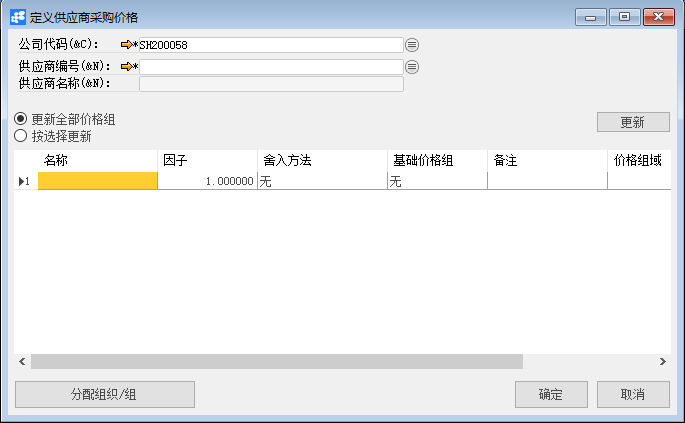
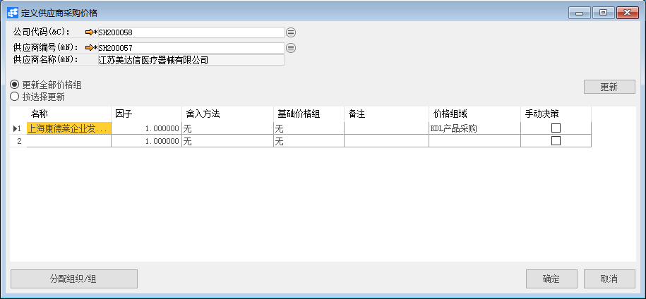
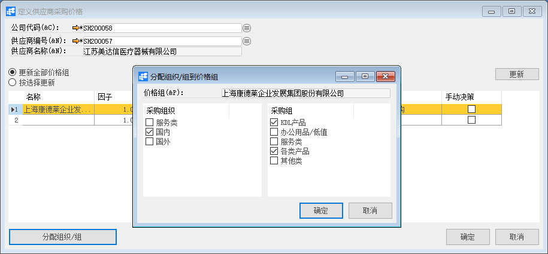
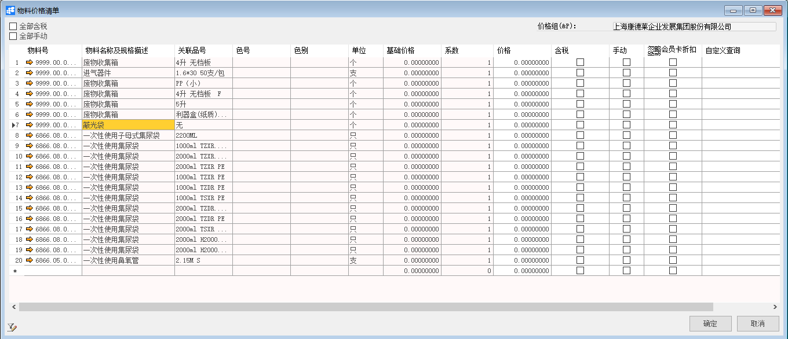
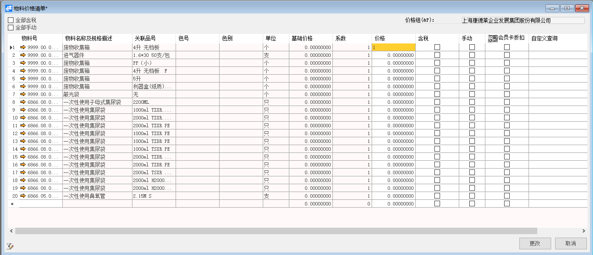
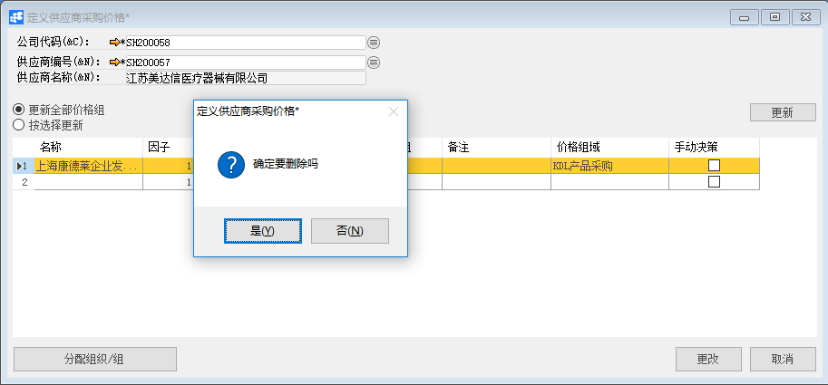
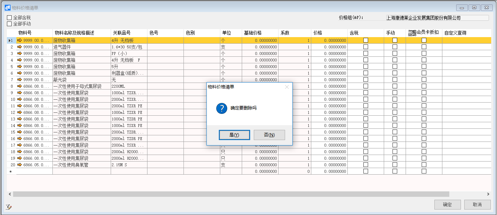

# 定义采购物料特殊价格

## 功能解释

使用此窗口可以定义系统中的物料的特殊价格即参考价格，可与采购订单等单据进行相关作用。

## 文章主旨

本文介绍如何通过BAP Nicer 5完成定义采购物料特殊价格的新增、修改及删除操作。

## 操作要求

当前登陆用户拥有操作定义采购物料特殊价格业务的权限，权限设置请在帮助文档中搜索查看。

## 新增定义采购物料特殊价格

1. 从主菜单【采购】->【定义】->【定义采购物料特殊价格】,打开定义供应商价格组窗口；

   

2. 选择公司代码、供应商，定义供应商价格组名称，选择价格组域；

   

3. 点击每行行头，选中当前行，再点击【分配组织/组】按钮，分配权限；

   

4. 双击第一行行头，数字1的位置，维护此供应商对此物料的基础采购价格；

   

5. 设置完毕，打开采购订单，选择物料系统自动带出当前供应商维护的价格；

6. 点击【添加】按钮，状态栏显示“新记录已保存！”信息，表示创建定义采购物料特殊价格成功；

## 修改定义采购物料特殊价格

1. 从主菜单【采购】->【定义】->【定义采购物料特殊价格】,打开定义供应商价格组窗口；

2. 选择公司代码、供应商，查找需要修改的定义采购物料特殊价格，修改必要的数据；

   

   

3. 点击【更改】按钮，状态栏显示“更改已保存！”信息，表示修改定义采购物料特殊价格成功。

## 删除定义采购物料特殊价格

1. 从主菜单【采购】->【定义】->【定义采购物料特殊价格】,打开定义供应商价格组窗口；

2. 选择公司代码、供应商，查找需要修改的定义采购物料特殊价格；

3. 点击工具栏的删除按钮，系统会提示删除确认。系统会提示确定要删除吗？点击【是】按钮，状态栏显示记录已删除，删除定义采购物料特殊价格成功。

   

   

## 属性与活动描述

| 属性       | 活动描述                     |
| ---------- | ---------------------------- |
| 供应商编号 | 选择供应商编号               |
| 物料号     | 选择显示物料号               |
| 名称及规格 | 显示物料名称                 |
| 品号       | 显示物料关联品号             |
| 色号       | 显示物料色号                 |
| 色别       | 显示物料色别                 |
| 单位       | 显示物料单位                 |
| 单价       | 输入该供应商此物料的特殊价格 |
| 是否含税   | 选择输入的单价是否含税       |
| 描述       | 输入备注信息                 |

