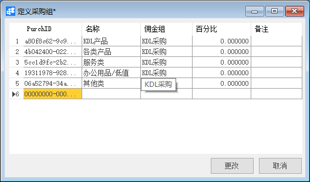
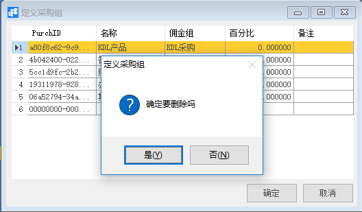

# 定义采购组

## 功能解释

使用此窗口可以定义系统中的采购组，采购组包含对采购的类型区分及佣金的分类。

## 文章主旨

本文介绍如何通过BAP Nicer 5完成定义采购组的新增、修改及删除操作。

## 操作要求

当前登陆用户拥有操作定义采购组业务的权限，权限设置请在帮助文档中搜索查看。

## 新增定义采购组

1. 从菜单栏【模块】->【采购】->【定义】->【定义采购组】,打开定义采购组窗口；

2. 编辑采购组名称，选择佣金组等；

   

3. 点击【更改】保存。

## 修改定义采购组

1. 从菜单栏【模块】->【采购】->【定义】->【定义采购组】，打开定义采购组界面；

2. 查找需要修改的定义采购组，修改必要的数据；

   

3. 点击【更改】按钮，状态栏显示“更改已保存！”信息，表示修改定义采购组成功；

## 删除定义采购组

1. 从系统菜单->【服务】->【定义采购组】,打开定义采购组窗口；

2. 查找要删除的定义采购组；

3. 点击工具栏的删除按钮，系统会提示删除确认。系统会提示确定要删除吗？点击【是】按钮，状态栏显示记录已删除，删除定义采购组成功。

   

## 定义采购组主数据

| 属性       | 活动描述       |
| ---------- | -------------- |
| 采购组名称 | 输入采购组名称 |
| 佣金组     | 选择佣金组     |

