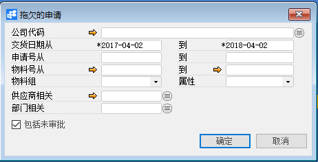
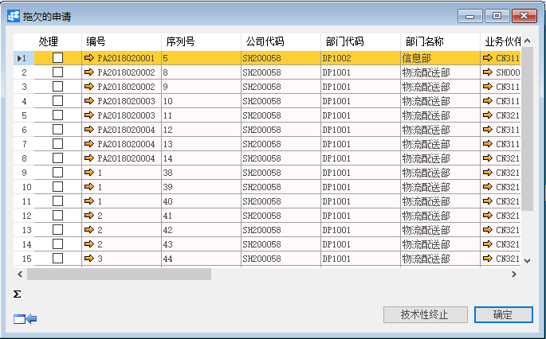
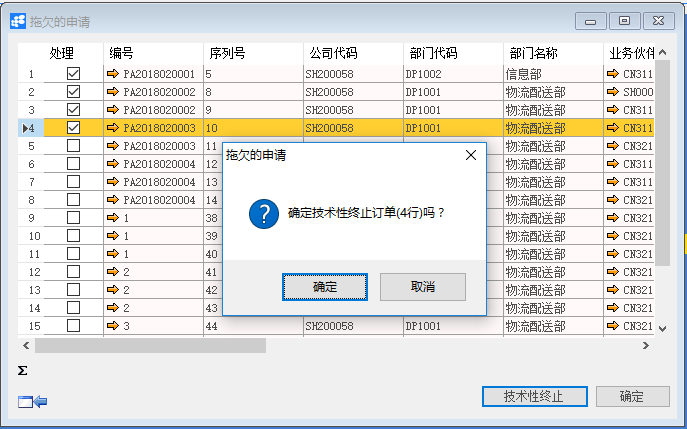

# 拖欠申请

## 功能解释

拖欠申请是查询拖欠的采购申请单，并且可以对其进行批量的中终止操作。

## 文章主旨

本文介绍如何通过BAP Nicer 5完成拖欠申请的操作。

## 操作要求

当前登陆用户拥有操作拖欠申请业务的权限，权限设置请在帮助文档中搜索查看。

## 新增拖欠申请

1. 从菜单栏【模块】->【采购】->【报表】->【拖欠申请】,打开拖欠申请窗口；

   

2. 输入查询订单的信息，如：公司代码、交货日期、申请日期、物料号等信息，点击【确定】得出查询结果；

   

3. 选择所需终止的单据，点击【技术性终止】即可终止申请。

   

## 拖欠申请主数据

| **属性**       | **活动描述**                         |
| -------------- | ------------------------------------ |
| 公司代码       | 选择要查询的公司。                   |
| 交货日期从、到 | 输入交货日期范围作为筛选条件         |
| 订单号从、到   | 输入订单号范围作为筛选条件           |
| 物料号从、到   | 输入物料号范围作为筛选条件           |
| 物料组         | 输入物料组作为筛选条件               |
| 属性           | 输入属性作为筛选条件                 |
| 供应商相关     | 输入供应商作为筛选条件               |
| 包括未审批     | 勾选后，报表运算包含未审批的采购申请 |

## 明细

| **属性**     | **活动描述**               |
| ------------ | -------------------------- |
| 处理         | 勾选后，进行技术性终止操作 |
| 编号         | 显示采购申请编号           |
| 序列号       | 显示采购申请序列号         |
| 公司代码     | 显示采购申请的公司代码     |
| 业务伙伴代码 | 显示采购申请的业务伙伴代码 |
| 业务伙伴名称 | 显示采购申请的业务伙伴名称 |
| 物料号       | 显示采购申请的物料号       |
| 物料名称     | 显示采购申请的物料名称     |
| 关联品号     | 显示物料的关联品号         |
| 色别         | 显示物料的色别             |
| 色号         | 显示物料的色号             |
| 交货日期     | 显示物料的交货日期         |
| 逾期         | 显示物料的逾期天数         |
| 数量         | 显示物料的采购数量         |
| 欠数量       | 显示物料采购未收货数量     |
| 技术性终止   | 点击技术性终止采购采购申请 |