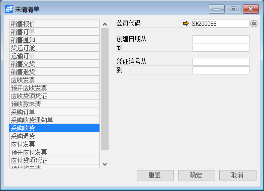
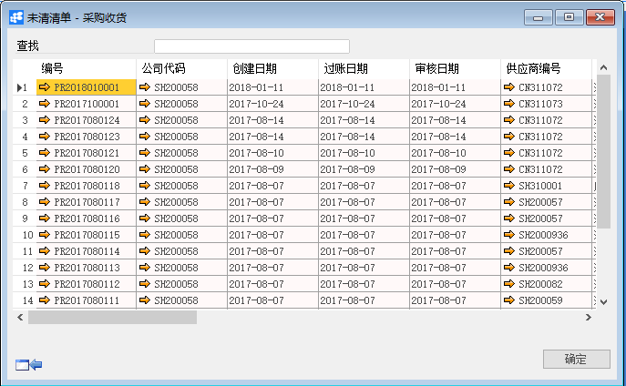

# 未清清单

## 功能解释

系统中所有销售、采购模块的未完成单据都可以在未清订单中进行查询。

## 文章主旨

本文介绍如何通过BAP Nicer 5完成未清清单的操作。

## 操作要求

当前登陆用户拥有操作未清清单业务的权限，权限设置请在帮助文档中搜索查看。

## 新增未清清单

1. 从菜单栏【模块】->【采购】->【报表】->【未清清单】,打开未清清单窗口；

2. 选择【采购收货】，输入关键信息：公司代码、创建日期等；

   

3. 点击【确定】得出查询结果；

   

## 未清清单主数据

| **属性** | **活动描述**         |
| -------- | -------------------- |
| 客户     | 选择未清清单对象客户 |

## 保修选项卡

| **属性** | **活动描述**                               |
| -------- | ------------------------------------------ |
| 星期一   | 星期一是否为客户提供服务工作日，打勾表示是 |

## 物料选项卡

| **属性** | **活动描述**        |
| -------- | ------------------- |
| 物料组   | 输入%模糊查找物料组 |

## 未清清单选项卡

| **属性** | **活动描述**                               |
| -------- | ------------------------------------------ |
| 呼叫编号 | 只读字段，显示未清清单被未清清单在所有次数 |

## 附件选项卡

| **属性**   | **活动描述**                                |
| ---------- | ------------------------------------------- |
| 从磁盘选择 | 要附加文件，单击“从磁盘选择…”按扭，选择文件 |

## 摘要选项卡

| **属性** | **活动描述**                 |
| -------- | ---------------------------- |
| 创建人   | 只读字段，显示系统登录用户名 |
| 备注     | 输入未清清单的必要备注       |