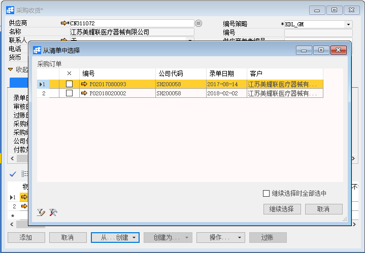
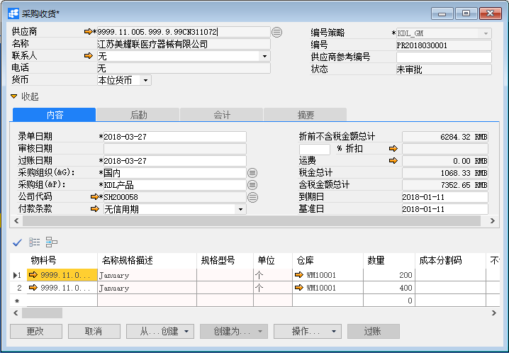
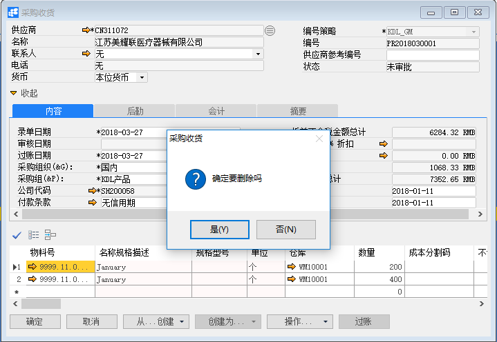

# 采购收货

## 功能解释

在收到供应商的货物时创建采购收货单，采购收货单过账后会更新仓库物料数量并创建会计凭证。

## 文章主旨

本文介绍如何通过BAP NICER 5完成采购收货的新增、修改及删除操作。

## 操作要求

当前登录用户拥有操作采购收货业务的权限，权限设置请在帮助文档中搜索查看。

## 新增采购收货

1. 从菜单栏【模块】->【采购】->【采购收货】,打开采购收货窗口；

2. 选择供应商、编号策略、采购组、采购组织等基础信息；

   

3. 如果凭证没有来源，则直接编辑采购收货物料信息，如：数量、价格、仓库、交货日期等；如果此采购收货有来源，可以点击【从…创建】，选择相应的凭据；

   

4. 点击【添加】按钮，状态栏显示“新记录已保存！”信息，表示创建采购收货成功；

5. 点击工具栏按钮，发起审批。

## 修改采购收货

1. 从菜单栏【模块】->【采购】->【采购收货】，打开采购收货界面；

2. 点击工具栏的查询按钮，查找需要修改的采购收货，修改必要的数据；

   

3. 点击【更改】按钮，状态栏显示“更改已保存！”信息，表示修改采购收货成功；

4. 点击工具栏按钮，发起审批。

## 删除采购收货

1. 从菜单栏【模块】->【采购】->【采购收货】,打开采购收货窗口；

2. 点击工具栏的浏览按钮，查找要删除的采购收货；

   

3. 点击工具栏的删除按钮，系统会提示删除确认。系统会提示确定要删除吗？点击【是】按钮，状态栏显示记录已删除，删除采购收货成功。

## 属性与活动描述

| 属性               | 活动描述                           |
| ------------------ | ---------------------------------- |
| 公司代码           | 选择公司代码                       |
| 供应商             | 选择供应商                         |
| 名称               | 显示供应商名称                     |
| 联系人             | 显示供应商默认联系人               |
| 供应商参考编号     | 输入供应商参考编号                 |
| 货币               | 选择订单使用的货币                 |
| 编号策略           | 选择单据的编号策略                 |
| 编号               | 显示单据编号                       |
| 录单日期           | 输入录单日期                       |
| 审核日期           | 显示审核日期                       |
| 过账日期           | 输入过账日期                       |
| 状态               | 显示单据状态                       |
| 采购组织           | 显示默认的采购组织                 |
| 采购组             | 选择采购组                         |
| 付款条款           | 选择采购订单的付款条款             |
| 到期日           | 显示基于付款条款的到期日             |
| 折前不含税金额总计 | 折前不含税金额总计                 |
| 折扣%              | 输入单据折扣                    |
| 运费               | 输入订单的运费，点击超链接输入明细 |
| 税金总计           | 显示单据的税金总计                 |
| 含税金额总计       | 显示单据的含税金额总计             |
| 采购订单           | 点击选择采购订单                 |
| 预开应付发票        | 点击选择预开应付发票             |
| 过账           | 点击将收货单过账                 |

## 内容

| 属性         | 活动描述                             |
| ------------ | ------------------------------------ |
| 物料号       | 显示物料号                           |
| 名称规格描述 | 显示物料描述                         |
| 关联品号     | 显示物料的关联品号                   |
| 色号         | 显示物料的色号                       |
| 色别         | 显示物料的色别                       |
| 单位         | 显示物料的采购单位                   |
| 长度         | 输入物料长度，是物料维度之一         |
| 宽度         | 输入物料宽度，是物料维度之一         |
| 高度         | 输入物料高度，是物料维度之一         |
| 重量         | 输入物料重量，是物料维度之一         |
| 特殊库存     | 输入特殊库存，是物料维度之一         |
| 特殊库存标识 | 输入特殊库存标识，是物料维度之一     |
| 体积         | 显示物料的体积                       |
| 体积单位     | 显示物料的体积单位                   |
| 仓库         | 显示物料的采购入的仓库               |
| 数量         | 输入物料的订单数量                   |
| 成本分割码         | 输入物料的成本分割码            |
| 税码         | 选择税码                             |
| 含税单价     | 输入物料采购的含税单价               |
| 含税金额     | 显示物料采购的含税金额               |
| 交货日期     | 输入物料的订单交货日期               |
| 来源         | 显示订单的来源单号，可超链接查看明细 |
| 明细号   | 显示收货单的明细号                     |
| 生产订单号   | 显示生产订单编号                     |
| 工序号       | 显示工序号                           |
| 项目         | 选择或显示关联项目                   |
| 每库存数量   | 显示物料的每库存数量                 |
| 库存数       | 显示物料的库存数                     |
| 是否分配运费 | 显示是否分配运费                     |
| 运费         | 显示运费金额                         |
| 检验批         | 显示物料的检验批                |
| 使用决策         | 输入物料质检的使用决策         |
| 成本中心     | 成本对象之一，输入成本中心编号       |
| 内部订单     | 成本对象之一，输入内部订单编号       |
| 生产订单     | 成本对象之一，输入生产订单编号       |
| 销售订单     | 暂无配置                             |
| 销售订单行   | 暂无配置                             |
| WBS          | 成本对象之一，输入项目结构中的WBS    |
| 网络         | 成本对象之一，输入项目结构中的网络   |
| 维修订单     | 成本对象之一，输入维修订单编号       |
| 流程         | 暂无配置                             |
| 获利分析段   | 暂无配置                             |
| 资产         | 暂无配置                             |

## 后勤

| 属性     | 活动描述           |
| -------- | ------------------ |
| 发运至   | 选择发运地址       |
| 开票至   | 选择开票地址       |
| 运输方式 | 选择采购的运输方式 |
| 备注 | 输入备注信息 |

## 会计

| 属性     | 活动描述           |
| -------- | ------------------ |
| 凭证号   | 显示凭证过账后自动生成的日记账分录，可链接查看明细       |
| 控制   | 显示凭证过账后自动生成的CO凭证，可链接查看明细       |
| 凭证备注 | 显示凭证备注 |

## 摘要

| 属性     | 活动描述           |
| -------- | ------------------ |
| 录单人   | 显示单据的创建人       |
