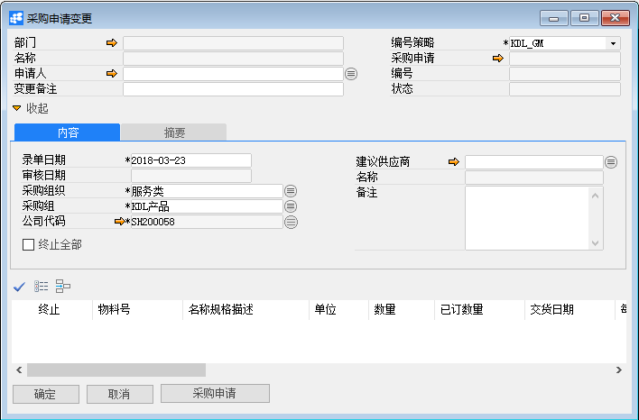
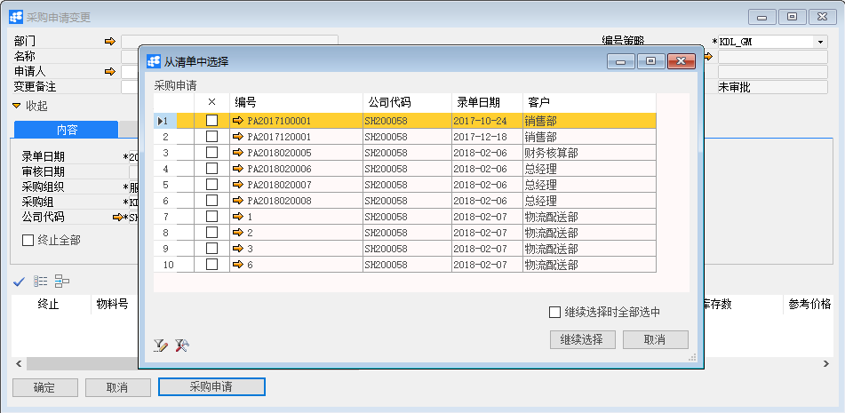
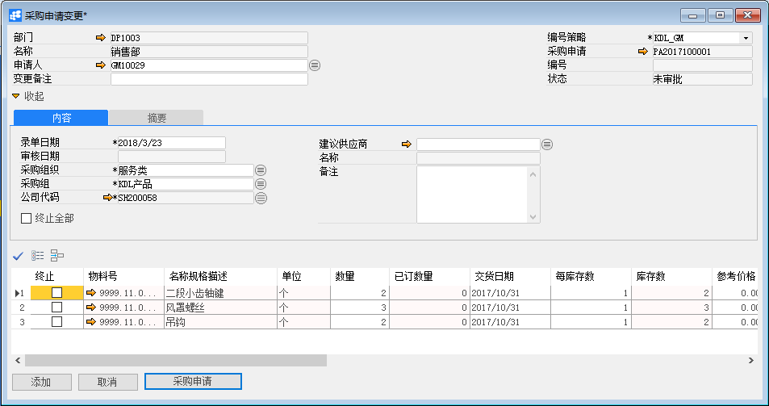
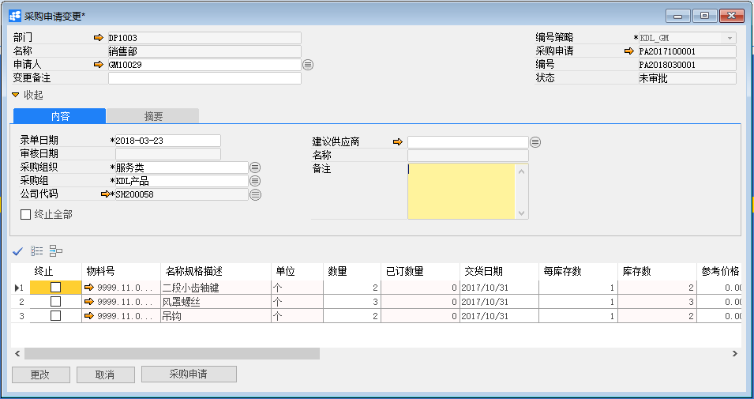
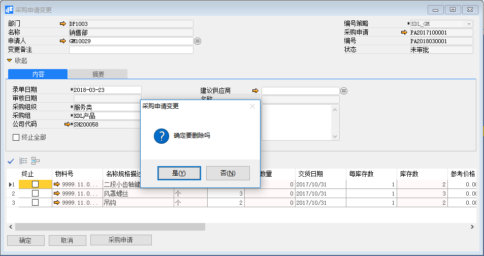

# 采购申请变更

## 功能解释

对已审批状态下的采购申请，如果需要更改信息，需要对此采购申请做采购申请变更。

## 文章主旨

本文介绍如何通过BAP Nicer 5完成采购申请变更的新增、修改及删除操作。

## 操作要求

当前登陆用户拥有操作采购申请变更业务的权限，权限设置请在帮助文档中搜索查看。

## 新增采购申请变更

1. 从菜单栏【模块】->【采购】->【申请与订单】->【采购申请变更】,打开采购申请变更窗口；

   

2. 点击【采购申请】，选择所需变更的采购申请单，点击【继续选择】可以选择所要变更的物料。如果单据全部需要修改，可以选择【继续选择时全部选中】，再点击【继续选择】；

   

3. 对采购申请的信息进行更改；

   

4. 点击【添加】按钮，状态栏显示“新记录已保存！”信息，表示创建采购申请变更成功；

5. 点击工具栏按钮，发起审批。

## 修改采购申请变更

1. 从菜单栏【模块】->【采购】->【申请与订单】->【采购申请变更】，打开采购申请变更界面；

2. 点击工具栏的查询按钮，查找需要修改的采购申请变更，修改必要的数据；

   

3. 点击【更改】按钮，状态栏显示“更改已保存！”信息，表示修改采购申请变更成功；

4. 点击工具栏按钮，发起审批。

## 删除采购申请变更

1. 从菜单栏【模块】->【采购】->【申请与订单】->【采购申请变更】,打开采购申请变更窗口；

2. 点击工具栏的浏览按钮 ，查找要删除的采购申请变更；

3. 点击工具栏的删除按钮，系统会提示删除确认。系统会提示确定要删除吗？点击【是】按钮，状态栏显示记录已删除，删除采购申请变更成功。

   

## 属性与活动描述

| 属性     | 活动描述                         |
| -------- | -------------------------------- |
| 公司代码 | 选择公司代码                     |
| 部门     | 选择申请部门                     |
| 名称     | 显示部门名称                     |
| 申请人   | 选择申请人                       |
| 变更备注 | 输入变更备注信息                 |
| 编号策略 | 选择单据的编号策略               |
| 采购申请 | 显示采购申请单号                 |
| 编号     | 显示单据编号                     |
| 录单日期 | 输入录单日期                     |
| 审核日期 | 显示审核日期                     |
| 状态     | 显示单据状态                     |
| 采购组织 | 显示默认的采购组织               |
| 终止全部 | 终止当前凭证中所有物料的采购申请 |
| 备注     | 输入备注信息                     |
| 采购申请 | 点击选择采购申请                 |

## 内容

| 属性         | 活动描述                             |
| ------------ | ------------------------------------ |
| 终止         | 选择终止当前物料的采购订单           |
| 物料号       | 显示物料号                           |
| 名称规格描述 | 显示物料描述                         |
| 关联品号     | 显示物料的关联品号                   |
| 色号         | 显示物料的色号                       |
| 色别         | 显示物料的色别                       |
| 单位         | 显示物料的采购单位                   |
| 长度         | 输入物料长度，是物料维度之一         |
| 宽度         | 输入物料宽度，是物料维度之一         |
| 高度         | 输入物料高度，是物料维度之一         |
| 重量         | 输入物料重量，是物料维度之一         |
| 特殊库存     | 输入特殊库存，是物料维度之一         |
| 特殊库存标识 | 输入特殊库存标识，是物料维度之一     |
| 体积         | 显示物料的体积                       |
| 体积单位     | 显示物料的体积单位                   |
| 仓库         | 显示物料的采购入的仓库               |
| 已定数量     | 显示采购申请已经转成订单的状态       |
| 交货日期     | 输入物料的订单交货日期               |
| 编号         | 显示采购申请的凭证编号 |
| 计划序列号         | 显示计划序列号 |
| 生产订单号   | 显示生产订单编号                     |
| 工序号       | 显示工序号                           |
| 建议供应商       | 选择采购申请的建议供应商          |
| 项目         | 选择或显示关联项目                   |
| 参考价格         | 输入采购参考价格     |
| 成本中心     | 成本对象之一，输入成本中心编号       |
| 内部订单     | 成本对象之一，输入内部订单编号       |
| 生产订单     | 成本对象之一，输入生产订单编号       |
| 销售订单     | 暂无配置                             |
| 销售订单行   | 暂无配置                             |
| WBS          | 成本对象之一，输入项目结构中的WBS    |
| 网络         | 成本对象之一，输入项目结构中的网络   |
| 维修订单     | 成本对象之一，输入维修订单编号       |
| 流程         | 暂无配置                             |
| 获利分析段   | 暂无配置                             |
| 资产         | 暂无配置                             |
| 录单人         | 显示单据创建人                   |
| 版本         | 显示采购变更版本     |