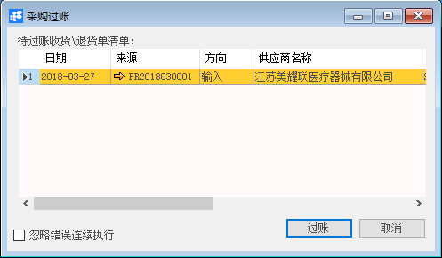
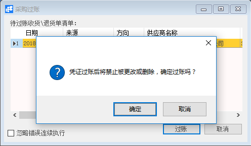

# 采购过账

## 功能解释

采购过账是对采购收货和采购退货的单据进行过账处理。

## 文章主旨

本文介绍如何通过BAP Nicer 5完成采购过账的操作。

## 操作要求

当前登陆用户拥有操作采购过账业务的权限，权限设置请在帮助文档中搜索查看。

## 新增采购过账

1. 从菜单栏【模块】->【采购】->【采购过账】,打开采购过账窗口；

2. 查找并选中要过账的单据；

   

3. 点击【过账】，进行过账操作。

   

## 采购过账主数据

| 属性           | 活动描述                                |
| -------------- | --------------------------------------- |
| 日期           | 收货/退货凭证的日期                     |
| 来源           | 显示收货/退货凭证的编号，可链接查看明细 |
| 方向           | 显示物料出入的方向                      |
| 供应商名称     | 显示凭证的供应商名称                    |
| 公司代码       | 显示凭证的公司代码                      |
| 供应商参考编号 | 显示供应商的参考编号                    |
| 货币           | 显示凭证使用的货币                      |
| 发运至         | 显示凭证的发运地址                      |
| 过账           | 凭证过账功能                            |

