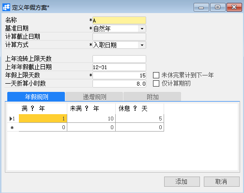
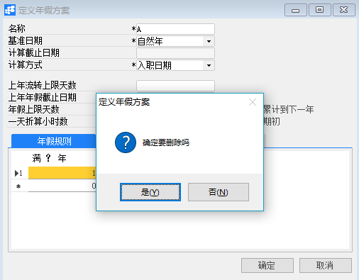

# 定义年假方案

 

## 功能解释

定义年假方案是根据公司年假管理细则添加至系统。

## 文章主旨

本文介绍如何通过BAP Business Cloud AI完成定义年假方案的新增、修改及删除操作。

## 操作要求

当前登录用户拥有操作定义年假方案业务的权限，权限设置请在帮助文档中搜索查看。

## 新增年假方案

1、 从系统菜单->【人力资源】->【休假管理】->【定义年假方案】，打开定义界面；

2、 点击工具栏新空白按钮准备新增年假方案；

3、 编辑年假方案信息；

 

4、 信息确认无误后点击【添加】或工具栏的保存按钮，保存年假方案。

## 修改年假方案

1、 从系统菜单->【人力资源】->【休假管理】->【定义年假方案】，打开定义界面；

2、 点击工具栏的浏览按钮，查找要修改的年假方案；

3、 修改年假方案的内容；

4、 点击【更改】或工具栏的保存按钮保存，更改年假方案。

## 删除年假方案

1、 从系统菜单->【人力资源】->【休假管理】->【定义年假方案】，打开定义界面；

2、 点击工具栏的浏览按钮，查找要删除的年假方案；

3、 点击工具栏的按钮，进行删除操作。

 

## 属性与活动描述

| **属性**     | **活动描述**           |
| ------------------ | ---------------------------- |
| 名称               | 年假方案的名称               |
| 基准日期           | 选择基准日期                 |
| 计算截止日期       | 计算截止日期                 |
| 计算方式           | 计算方式                     |
| 上年流转上限天数   | 上一年流转到下一年的上限天数 |
| 上年年假截止日期   | 上年年假截止日期             |
| 年假上限天数       | 年假的上限天数               |
| 未休完累计到下一年 | 未休完是否累计到下一年       |
| 一天折算小时数     | 一天折算小时数               |
| 仅计算期初         | 勾选是否仅计算期初           |

## 年假规则

| **属性** | **活动描述** |
| -------------- | ------------------ |
| 满？年         | 工作已满年数       |
| 未满？年       | 工作未满年数       |
| 休息？天       | 休息的天数         |

## 递增规则

| **属性** | **活动描述**                                           |
| -------------- | ------------------------------------------------------------ |
| 满？年         | 工作已满年数，该年数必须不小于年假规则中的最大的工龄未满年数 |
| 每？年         | 在原有工龄上每增加的年数                                     |
| 递增？天       | 年假增加的天数                                               |

## 附加

| **属性**   | **活动描述**   |
| ---------------- | -------------------- |
| 未满一年折算方式 | 选择未满一年折算方式 |
| 备注             | 输入备注             |

 
