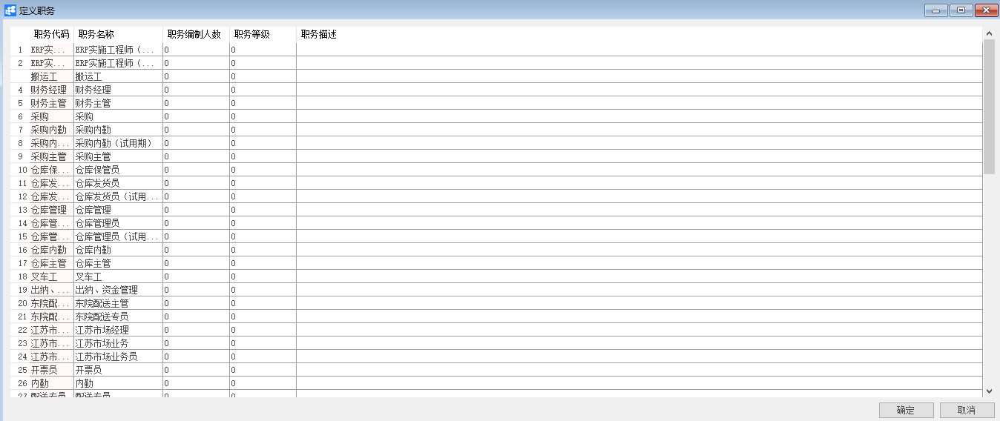
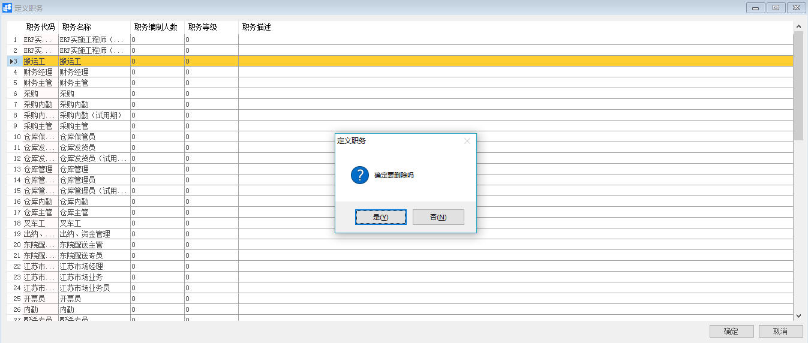

# 定义职务 

 

## 功能解释 

定义职务是指依据企业的制度与规则，定义不同的职务，如总经理、经理、主管等；可输入职务编制人数、职务等级、职务描述与评估方案。与员工主数据岗位字段对应，绑定员工职务信息；

## 文章主旨 

本文介绍如何通过BAP Business Cloud AI完成定义职务，新增、修改及删除操作。

## 操作要求 

当前登录用户拥有操作定义职务业务的权限，权限设置请在帮助文档中搜索查看。

## 新增定义职务 

1、 从系统菜单->【人力资源】->【定义】->【定义职务】，打开定义职务界面；

2、 编辑职务代码、职务名称、职务编制人数等信息；

3、 点击【添加】或工具栏的保存按钮进行保存。

## 修改定义职务 

1、 从系统菜单->【人力资源】->【定义】->【定义职务】，打开定义职务界面；

2、 修改定义职务内容；

3、 点击【更改】或工具栏的保存按钮进行更改职务内容。

## 删除定义职务 

1、 从系统菜单->【人力资源】->【定义】->【定义职务】，打开定义职务界面；

2、 选中要删除的那一行：

3、 点击工具栏的按钮，进行删除操作。

## 属性与活动描述 

| **属性**     | **活动描述**     |
| ------------ | ---------------- |
| 职务代码     | 输入职务代码     |
| 职务名称     | 输入职务名称     |
| 职务编制人数 | 输入职务编制人数 |
| 职务等级     | 输入职务等级     |
| 职务描述     | 输入职务描述     |

 
