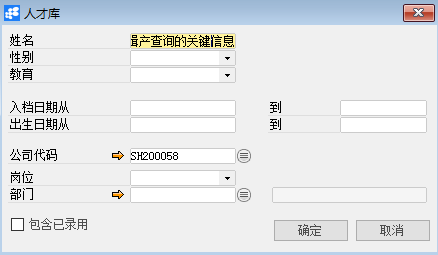

# 人才库 

 

## 功能解释 

运用此功能可以集中查看候选人和已录入人才的信息。

## 文章主旨 

本文介绍如何通过BAP Business Cloud AI完成人才库，新增、修改及删除操作。

## 操作要求 

当前登录用户拥有操作人才库的权限，权限设置请在帮助文档中搜索查看。

## 新增人才库 

1、 从系统菜单->【人力资源】->【招聘管理】->【人才库】，打开定义界面；	

2、 编辑产查询的关键信息；

 

3、 点击【确定】进入结果界面。若人才库中有人需面试，可以选择行后点击【启动面试流程】按钮。

 

## 属性与活动描述 

| **属性** | **活动描述**               |
| -------------- | -------------------------------- |
| 姓名           | 依据姓名查询                     |
| 性别           | 依据性别查询                     |
| 教育           | 根据受教育程度查询               |
| 入档日期从…到  | 根据入档日期范围进行查询         |
| 出生日期从…到  | 根据出生日期进行查询             |
| 公司代码       | 根据所属公司进行查询             |
| 岗位           | 根据岗位查询                     |
| 部门           | 根据部门查询                     |
| 包含已录用     | 查询结果中包含已经录用的人才信息 |

 
