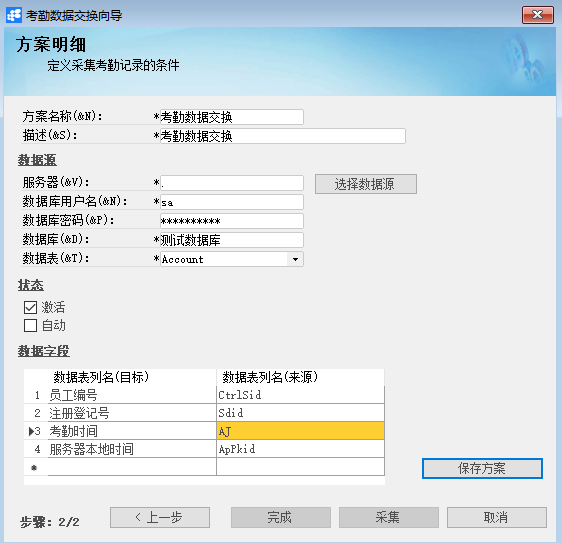
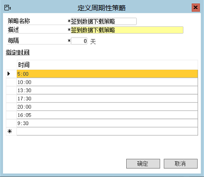
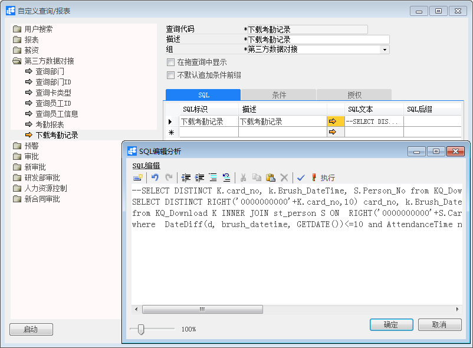

# 考勤机数据交换 

## 功能解释 

BAP软件支持与第三方考勤机系统的集成，通过定义考勤机数据交换方案，实现考勤机数据的自动下载，并与企业内部局域网中或Internet上的Microsoft SQL Server数据库进行交互作业，并且系统内的员工信息、部门信息也可通过数据交换上传至考勤机中。用户可直接在系统内查询员工的打卡信息，从而进行考勤结算、薪资结算等后续操作。

 

## 文章主旨 

本文介绍如何通过BAP Business Cloud AI完成考勤机数据与HR系统的交换。

## 操作要求 

当前登录用户拥有操作考勤机数据交换的权限。

## 数据交换向导 

打开【管理】--->【数据交换】--->【数据交换向导】，选择已存在的方案或创建新方案。

 

 

 

 

## 属性与活动描述 

| **属性**   | **活动描述**                                           |
| ---------------- | ------------------------------------------------------------ |
| 数据源（从）     | 选择企业内部局域网中或Internet上的Microsoft SQL Server考勤机数据库，即考勤数据来源； |
| 数据源（到）     | 选择BAP软件中的考勤机数据表；                                |
| 自动采集策略     | 在此功能中设置时间点，可实现在指定时间内的数据自动交换；     |
| 自定义查询（从） | 通过自定义编写SQL语句，实现数据的对应。 |

 
