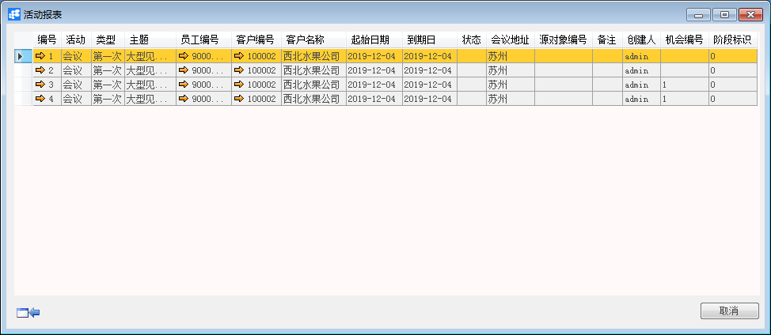

# 活动报表

## 功能解释 

BAP Business Cloud AI 活动报表可以查看您自己或其它用户分配给您的所有活动。

## 文章主旨 

本文介绍如何通过BAP Business Cloud AI完成活动报表的查询。

## 操作要求 

当前登录用户须拥有对活动报表查询的操作权限，如何设置该权限请在客户关系权限相关章节中搜索查看。

## 查询活动报表

1、从菜单窗口，【客户关系】->【报表】->【活动报表】，打开活动报表窗口；

2、可以根据客户编号范围、活动编号范围、开始日期范围、结束时间范围及活动其它条件查询；

3、单击“确定”按扭。 

##  属性与活动描述

## 活动查询窗口

| 属性           | 活动描述                       |
| -------------- | ------------------------------ |
| 客户编号从、到 | 根据客户编号范围查询           |
| 活动编号从、到 | 根据活动编号范围查询           |
| 机会编号从、到 | 根据机会编号范围查询           |
| 开始日期从、到 | 根据开始日期范围查询           |
| 结束时间从、到 | 根据结束时间范围查询           |
| 备注           | 根据活动备注关键字信息查询     |
| 活动           | 根据活动状态查询               |
| 类型           | 根据活动类型查询               |
| 主题           | 根据活动主题查询               |
| 优先级         | 根据活动优先级条件查询         |
| 会议地点       | 根据活动有关会议地点关键字查询 |
| 状态           | 根据活动状态查询               |
| 不包含未激活   | 是否只查询已激活的活动         |
| 不包含已结算   | 是否只查询未结算的活动         |

## 活动报表窗口

| 属性       | 活动描述                   |
| ---------- | -------------------------- |
| 编号       | 显示活动编号               |
| 活动       | 显示活动类型               |
| 类型       | 显示活动更详细类型         |
| 主题       | 显示活动有关类型下详细主题 |
| 员工编号   | 显示员工编号               |
| 客户编号   | 显示客户编号               |
| 客户名称   | 显示客户名称               |
| 起始日期   | 显示活动起始日期           |
| 到期日     | 显示活动结束日期           |
| 状态       | 显示活动状态               |
| 会议地址   | 显示会议地址               |
| 源对象编号 | 显示源对象编号             |
| 备注       | 显示活动备注信息           |
| 创建人     | 显示创建活动系统用户       |
| 机会编号   | 显示销售机会的编号         |
| 阶段标识   | 显示销售机会的标识         |
