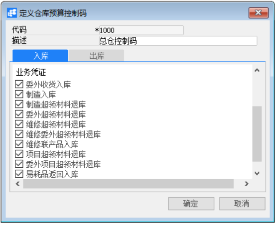
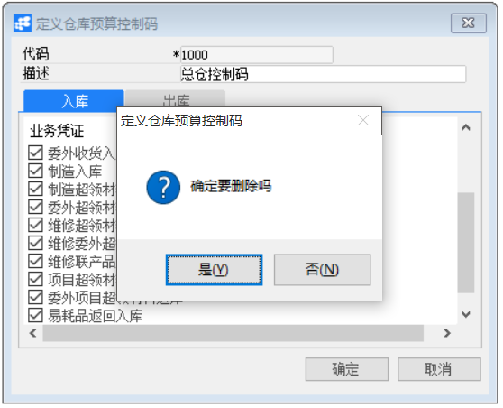

**定义仓库控制码**

 

**功能解释**

此功能可以定义项目模块所用的仓库控制码。

**文章主旨**

本文介绍如何通过BAP Nicer 5完成定义仓库控制码的新增、修改及删除操作。

**操作要求**

当前登陆用户拥有操作定义项目组业务的权限，权限设置请在帮助文档中搜索查看。

**新增仓库控制码**

1、 从菜单窗口，【项目】->【定义】->【定义仓库控制码】，打开创建界面；

2、 编辑代码、描述和需要控制的出入库业务凭证；

3、 点击【更改】保存。

​                                                  

**修改仓库控制码**

1、 从菜单窗口，【项目】->【定义】->【定义仓库控制码】，打开创建界面；

2、 修改仓库控制码的内容；

3、 点击【更改】或工具栏的保存按钮   保存，更改仓库控制码。

**删除仓库控制码**

1、 从菜单窗口，【项目】->【定义】->【定义仓库控制码】，打开创建界面；

2、 点击   选中需要删除的仓库控制码；

3、 点击工具栏的   按钮，进行删除操作。

   

**属性与活动描述**

| **属性** | **活动描述**               |
| -------- | -------------------------- |
| 代码     | 输入仓库控制码的代码       |
| 描述     | 输入仓库控制码的名称       |
| 入库     | 勾选需要控制的出库业务凭证 |
| 出库     | 勾选需要控制的入库业务凭证 |

 