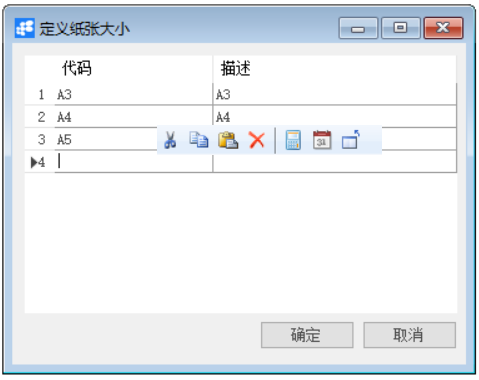
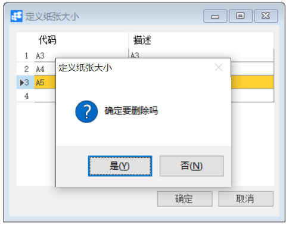

**定义纸张大小**

 

**功能解释**

此功能可以定义项目模块所用的纸张大小。纸张大小是指项目构建中图纸类文档的纸张大小。

**文章主旨**

本文介绍如何通过BAP Nicer 5完成定义纸张大小的新增、修改及删除操作。

**操作要求**

当前登陆用户拥有操作定义项目组业务的权限，权限设置请在帮助文档中搜索查看。

**新增纸张大小**

1、 从菜单窗口，【项目】->【定义】->【定义纸张大小】，打开创建界面；

2、 编辑代码、描述信息；

3、 点击【更改】保存。

​                                                  

**修改纸张大小**

1、 从菜单窗口，【项目】->【定义】->【定义纸张大小】，打开创建界面；

2、 修改纸张大小的内容；

3、 点击【更改】或工具栏的保存按钮   保存，更改纸张大小。

**删除纸张大小**

1、 从菜单窗口，【项目】->【定义】->【定义纸张大小】，打开创建界面；

2、 选中需要删除的纸张大小行；

3、 点击工具栏的   按钮，进行删除操作。

   

**属性与活动描述**

| **属性** | **活动描述**       |
| -------- | ------------------ |
| 代码     | 输入纸张大小的代码 |
| 描述     | 输入纸张大小的名称 |

 