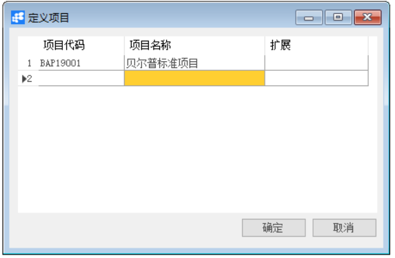
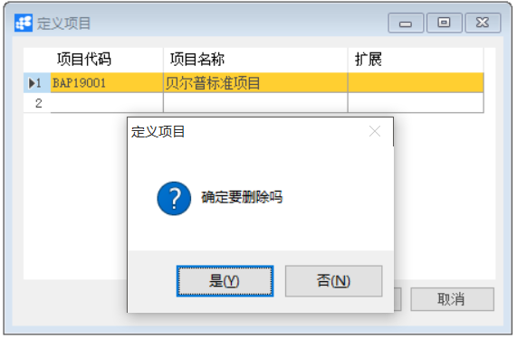

**定义项目**

 

**功能解释**

此功能可以定义项目模块所用的项目。

**文章主旨**

本文介绍如何通过BAP Nicer 5完成定义项目的新增、修改及删除操作。

**操作要求**

当前登陆用户拥有操作定义项目业务的权限，权限设置请在帮助文档中搜索查看。

**新增项目**

1、 从菜单窗口，【管理】->【基础定义】->【一般】->【定义项目】，打开创建界面；

2、 编辑项目代码和项目名称等信息；

3、 点击【更改】保存。

                                                  

**修改项目**

1、 从菜单窗口，【管理】->【基础定义】->【一般】->【定义项目】，打开创建界面；

2、 修改项目的内容；

3、 点击【更改】或工具栏的保存按钮   保存，更改项目。

**删除项目**

1、 从菜单窗口，【管理】->【基础定义】->【一般】->【定义项目】，打开创建界面；

2、 选中需要删除的那一行；

3、 点击工具栏的   按钮，进行删除操作。

   

**属性与活动描述**

| **属性** | **活动描述**   |
| -------- | -------------- |
| 项目代码 | 输入项目的代码 |
| 项目名称 | 输入项目的名称 |

 