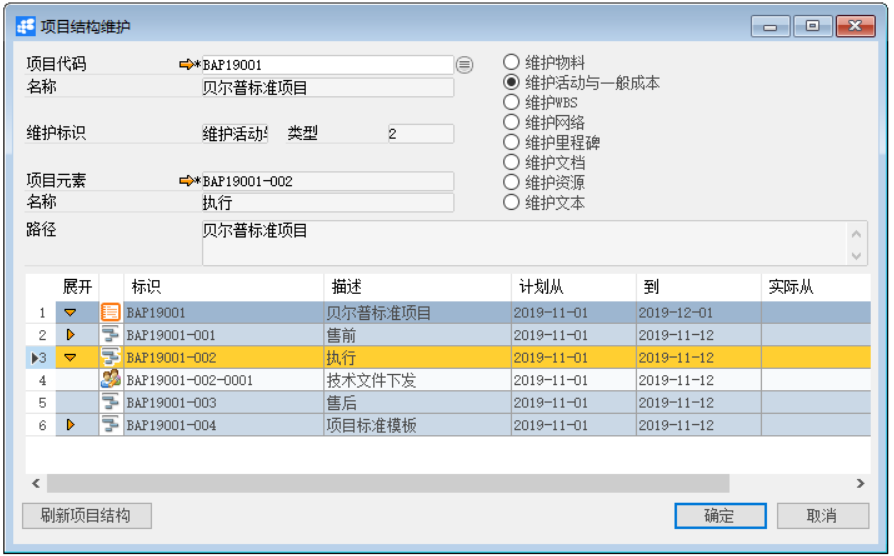

**项目结构维护**

 

**功能解释**

此功能可以定义项目模块所用的项目的结构维护。

**文章主旨**

本文介绍如何通过BAP Nicer 5完成定义项目结构维护的新增、修改及删除操作。

**操作要求**

当前登陆用户拥有操作定义项目业务的权限，权限设置请在帮助文档中搜索查看。

**项目结构维护**

1、 从菜单窗口，【项目】->【项目结构维护】打开项目结构维护界面；

2、 单击 按钮，打开查找项目窗口

3、 在查找项目窗口输入关键字或选择状态、创建人，单击【执行搜索】按钮；

4、 在查找项目结果列表中选中一个项目，单击【确认】按钮；

5、 点击【刷新项目结构】按钮，选择需要维护的节点；

6、 选择该节点需要维护的类型，点击【确定】按钮；

   

7、 输入所要维护的内容，点击【确定】按钮；

   

8、 点击【刷新项目结构】按钮。

   

**属性与活动描述**

| **属性** | **活动描述**                         |
| -------- | ------------------------------------ |
| 项目代码 | 自动显示所选项目的项目代码           |
| 名称     | 根据项目代码自动显示项目名称         |
| 维护标识 | 根据选择维护的类型字段显示维护标识   |
| 类型     | 根据选择维护的类型字段显示类型       |
| 项目元素 | 根据所选项目的节点自动显示节点的代码 |
| 名称     | 根据节点的代码自动显示节点的描述     |
| 路径     | 根据项目显示项目的描述               |

 