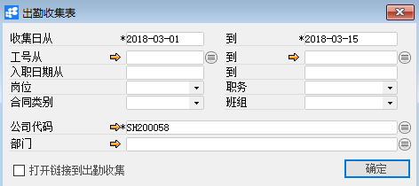

# 出勤收集表 

 

## 功能解释 

出勤收集表是用于查询已经添加的员工出勤收集的历史数据。

## 文章主旨 

本文介绍如何通过BAP Business Cloud AI完成出勤收集表查询操作。

## 操作要求 

当前登录用户拥有操作出勤收集表的权限，权限设置请在帮助文档中搜索查看。

## 查询出勤收集表 

1、 从系统菜单->【人力资源】->【考勤管理】->【出勤收集表】，打开定义界面；

2、 填写查询关键信息；

 

3、 点击【确定】进入结果界面。

 

## 属性与活动描述 

| **属性**     | **活动描述**                                   |
| ------------------ | ---------------------------------------------------- |
| 收集日从…到        | 收集日期区间                                         |
| 工号从…到          | 员工工号区间                                         |
| 入职日期从…到      | 员工入职区间                                         |
| 岗位               | 岗位                                                 |
| 职务               | 职务                                                 |
| 合同类别           | 合同类别                                             |
| 班组               | 班组                                                 |
| 公司代码           | 选择公司代码                                         |
| 部门               | 部门                                                 |
| 打开链接到工时收集 | 选择是否在报表中显示链接，可通过此连接打开出勤收集单 |

 
