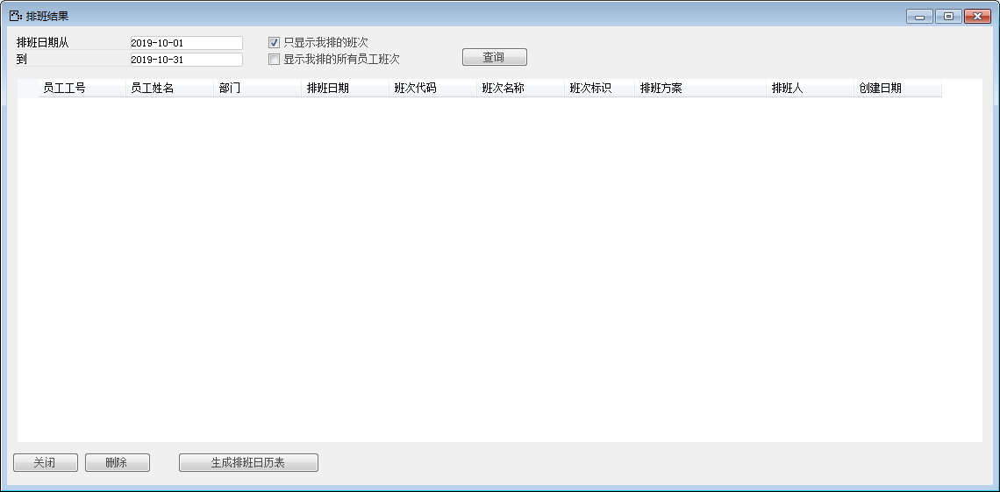

# 排班清单 

 

## 功能解释 

在此功能模块中，用户可以迅速快捷地查阅到所需要查询的员工排班信息，并可在此功能模块中对排班进行快捷地修改、删除、增加操作。

 

## 文章主旨 

本文介绍如何通过BAP Business Cloud AI完成排班清单的对排班进行增加、删除、修改、查询操作。

## 操作要求 

当前登录用户拥有操作排班清单的权限，权限设置请在帮助文档中搜索查看。

## 查询排班表 

1、从【人力资源】-〉【考勤管理】-〉【排班清单】，打开排班清单窗口；

 

2、按用户需求选择是否要勾选勾选框，点击【查询】

3、点击下方【生成排班日历表】，或者选中特定行，再点击【生成排班日历表】；

 

在此排班日历中，查看员工排班，也可选中特定行，右键进行修改、删除排班。

 

 

 

 

## 排班清单窗口数据 

| **属性**         | **活动描述**                         |
| ---------------------- | ------------------------------------------ |
| 只显示我排的班次       | 只查看由用户本人创建的排班；               |
| 显示我排的所有员工班次 | 勾选后，可以查看用户本人排的所有员工班次； |

 
