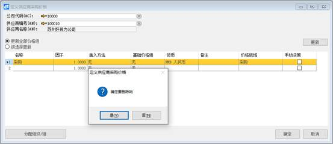

# 定义供应商采购价格 

## 功能解释 

此功能可以定义采购模块所用的供应商采购价格。

## 文章主旨 

本文介绍如何通过BAP Business Cloud AI完成定义供应商采购价格的新增、修改及删除操作。

## 操作要求 

当前登录用户须拥有对供应商采购价格创建、更改或删除的操作权限，如何设置该权限请在采购权限相关章节中搜索查看。

## 新增供应商采购价格 

1、 从菜单窗口，【采购】->【定义】->【定义供应商采购价格】，打开创建界面；

2、 选择供应商编号；

3、 在明细行中输入名称、货币、备注、价格组域，选择舍入方法、基础价格组等信息；

4、 点击【更改】保存。

5、 选中价格组，双击行头，打开物料价格清单；

6、 输入物料号，价格等信息；

7、 点击【更改】；

8、 选中物料价格，双击行头，打开日期数量折扣；

9、 输入日期从，日期到，数量，折扣，公式，说明，勾选含税，折扣，忽略会员卡折扣策略；

10、     点击【更改】。

## 修改供应商采购价格 

1、 从菜单窗口，【采购】->【定义】->【定义供应商采购价格】，打开创建界面；

2、 修改供应商采购价格；

3、 点击【更改】或工具栏的保存按钮保存，更改供应商采购价格；

4、 选中价格组，双击价格组行头，修改物料价格清单；

5、 点击【更改】或工具栏的保存按钮保存，更改物料价格清单；

6、 选中物料价格清单，双击物料价格清单行头，修改日期折扣数量；

7、 点击【更改】或工具栏的保存按钮保存，更改日期折扣数量；

## 删除供应商采购价格 

1、从菜单窗口，【采购】->【定义】->【定义供应商采购价格】，打开创建界面；

2、 选中需要删除的那一行；

3、 点击工具栏的按钮，进行删除操作。

## 属性与活动描述 

## 定义供应商采购价格 

| **属性**   | **活动描述**                           |
| ---------- | -------------------------------------- |
| 供应商编号 | 输入供应商代码，作为供应商的代码选择项 |
| 名称       | 输入供应商价格组的名称                 |
| 因子       | 输入价格组的因子                       |
| 舍入方法   | 选择采购价格的舍入方法                 |
| 基础价格组 | 选择基础价格组                         |
| 货币       | 选择价格组的货币                       |
| 备注       | 输入价格组的备注                       |
| 价格组域   | 选择价格组域                           |
| 手动决策   | 勾选表示为手动决策                     |

## 物料价格清单 

| **属性**           | **活动描述**                    |
| ------------------ | ------------------------------- |
| 物料号             | 输入物料号                      |
| 物料名称及规格描述 | 显示该物料的名称及规格描述      |
| 关联品号           | 显示该物料的关联品号            |
| 色号               | 显示该物料的色号                |
| 色别               | 显示该物料的色别                |
| 单位               | 显示该物料的单位                |
| 基础价格           | 显示该物料的基础价格            |
| 系数               | 显示该物料的系数                |
| 价格               | 显示该物料的价格                |
| 含税               | 勾选表示为含税                  |
| 手动               | 勾选表示为手动                  |
| 忽略会员卡折扣策略 | 勾选表示为忽略会员卡折扣策略    |
| 自定义查询         | 填写sql查询语句，进行自定义查询 |
| 日期数量折扣       | 显示日期数量折扣                |

## 日期数量折扣 

| **属性**           | **活动描述**                 |
| ------------------ | ---------------------------- |
| 日期从             | 输入该物料折扣的有效开始日期 |
| 日期到             | 输入该物料折扣的有效结束日期 |
| 数量               | 输入该物料的达到折扣的数量   |
| 价格/折扣%         | 输入该物料的折扣             |
| 含税               | 勾选表示为该物料价格含税     |
| 折扣               | 勾选表示为使用该折扣         |
| 忽略会员卡折扣策略 | 勾选表示为忽略会员卡折扣策略 |
| 公式               | 输入折扣的公式               |
| 说明               | 输入该物料折扣的说明         |

 

 

 

 

 
