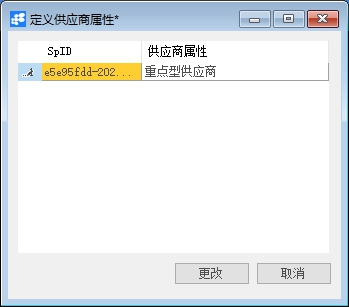
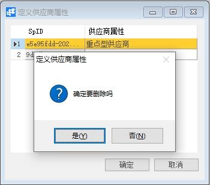

# 定義供應商内容

## 功能解釋

此功能可以定義採購模塊所用的供應商所具有的内容。

## 文章主旨 

本文介紹如何通過BAP Business Cloud AI完成定義供應商内容的新增、修改及删除操作。

## 操作要求

當前登入用戶須擁有對供應商内容創建、更改或删除的操作許可權，如何設定該許可權請在採購許可權相關章節中蒐索查看。

## 新增供應商内容

1、從選單視窗，【採購】->【定義】->【定義供應商内容】，打開創建介面；

2、編輯供應商内容名稱；

3、點擊【更改】保存。

 

## 修改供应商属性 

1、 从菜单窗口，【采购】->【定义】->【定义供应商属性】，打开创建界面；

2、 修改供应商属性的内容；

3、 点击【更改】或工具栏的保存按钮保存，更改供应商属性。

## 删除供应商属性 

1、从菜单窗口，【采购】->【定义】->【定义供应商属性】，打开创建界面；

2、 选中需要删除的那一行；

3、 点击工具栏的按钮，进行删除操作。

 

## 属性与活动描述 

| **属性**   | **活动描述**                           |
| ---------- | -------------------------------------- |
| 供应商属性 | 输入供应商属性，作为供应商的属性选择项 |

 

 

 

 
