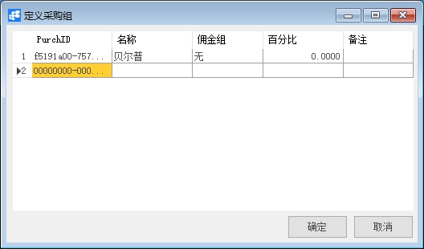

# 定义采购组

## 功能解释

此功能可以定义采购模块所用的采购组，采购组包含对采购的类型区分及佣金的分类。

## 文章主旨

本文介绍如何通过BAP Business Cloud AI完成定义采购组的新增、修改及删除操作。

## 操作要求

当前登录用户须拥有对采购组创建、更改或删除的操作权限，如何设置该权限请在采购权限相关章节中搜索查看。

## 新增采购组 

1、 从菜单窗口，【采购】->【定义】->【定义采购组】，打开创建界面；

2、 编辑采购组名称、佣金组、百分比、备注；

3、 点击【更改】保存。

 

## 修改采购组 

1、 从菜单窗口，【采购】->【定义】->【定义采购组】，打开创建界面；

2、 修改采购组的内容；

3、 点击【更改】或工具栏的保存按钮保存，更改采购组。

## 删除采购组 

1、 从菜单窗口，【采购】->【定义】->【定义采购组】，打开创建界面；

2、 选中需要删除的那一行；

3、 点击工具栏的按钮，进行删除操作。

 

## 属性与活动描述 

| **属性** | **活动描述**                           |
| -------------- | -------------------------------------------- |
| 采购组名称     | 输入采购组的名称                             |
| 佣金组         | 输入该采购组的所属佣金组，可选择定义新佣金组 |
| 百分比         | 输入佣金的百分比                             |
| 备注           | 输入采购组的备注信息                         |

 

 
