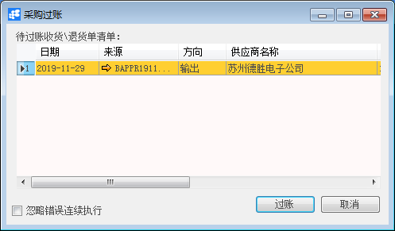

# 过账 

## 功能解释 

此功能过账或批量过账采购收货/退货凭证。凭证来源请查看和章节。

## 文章主旨 

本文介绍如何通过BAP Business Cloud AI完成采购收货/退货的过账操作。

## 操作要求 

当前登录用户须拥有对采购收货/退货的过账的操作权限，如何设置该权限请在采购权限相关章节中搜索查看。

## 采购过账

注意：只能过账“已批准”状态的收货/退货凭证。

1、打开系统主菜单中选择 采购->过账；

2、选中要过账的收货/退货凭证，可选择多张凭证；

3、单击“过账”按钮，在弹出的确认窗口中选择“确定”。

## 属性与活动描述

| 属性           | 活动描述                                |
| -------------- | --------------------------------------- |
| 日期           | 收货/退货凭证的日期                     |
| 来源           | 显示收货/退货凭证的编号，可链接查看明细 |
| 方向           | 显示物料出入的方向                      |
| 供应商名称     | 显示凭证的供应商名称                    |
| 公司代码       | 显示凭证的公司代码                      |
| 供应商参考编号 | 显示供应商的参考编号                    |
| 货币           | 显示凭证使用的货币                      |
| 发运至         | 显示凭证的发运地址                      |
| 创建人         | 显示凭证的创建人                        |
| 过账           | 凭证过账功能                            |

