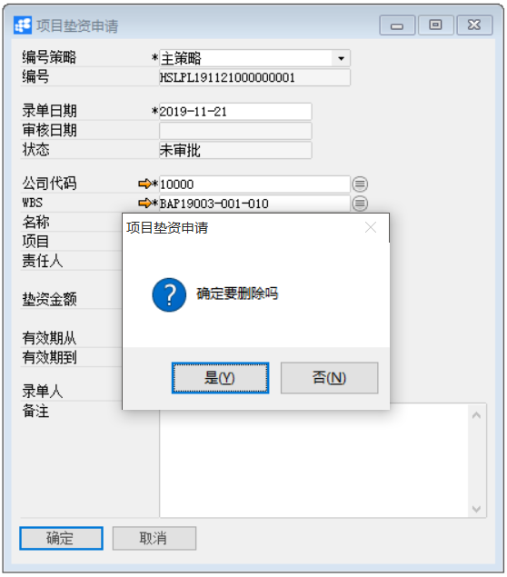

# 项目垫资申请

 

## 功能解释

运用此功能可以对已定义的项目定义垫资申请。项目预算时如果超出了预算，系统禁止超出预算的业务发生，这时可以作项目垫资申请来增加预算金额，使得可以继续推进项目。

## 文章主旨

本文介绍如何通过BAP Business Cloud AI完成项目垫资申请。

## 操作要求

当前登录用户须拥有对定义垫资申请创建或更改的操作权限，如何设置该权限请在定义用户权限相关章节中搜索查看。

## 新建项目垫资申请

1、 单击菜单模块【项目】->【规划】->【项目垫资申请】，打开项目垫资申请窗口；

2、 单击  按钮，输入关键字信息，点击【执行查找】查找需要垫资的wbs节点；

3、 选择责任人，输入垫资金额和有效期信息

4、 单击【添加】按扭；

   

5、 点击  按钮发起审批。

 

## 修改项目垫资申请

1、 单击菜单模块【项目】->【规划】->【项目垫资申请】，打开项目垫资申请窗口；

2、 单击工具栏   按钮，选择需要修改的垫资申请；

3、 修改垫资申请的内容，置灰的属性不允许修改；

4、 点击【更改】按钮保存。

   

5、 点击   按钮发起审批。

## 删除项目垫资申请

1、 单击菜单模块【项目】->【规划】->【项目垫资申请】，打开项目垫资申请窗口；

2、 单击工具栏   按钮，选择需要删除的垫资申请；

3、 点击工具栏   按钮，删除垫资申请；

   

## 属性与活动描述

| **属性**     | **活动描述**                 |
| ------------ | ---------------------------- |
| 编号策略     | 根据公司选择编号策略         |
| 编号         | 根据编号策略自动显示编号     |
| 录单日期     | 输入录单日期                 |
| 审核日期     | 自动显示项目垫资申请审核日期 |
| 状态         | 显示垫资申请审批状态         |
| 公司代码     | 选择显示公司代码             |
| WBS          | 选择显示项目的WBS代码        |
| 名称         | 根据WBS代码自动显示名称      |
| 项目         | 根据WBS自动显示项目代码      |
| 责任人       | 选择显示责任人工号           |
| 垫资金额     | 输入垫资金额                 |
| 有效期从…到… | 输入有效期范围               |
| 录单人       | 显示系统用户名               |
| 备注         | 输入对项目垫资申请的必要备注 |

 

   
