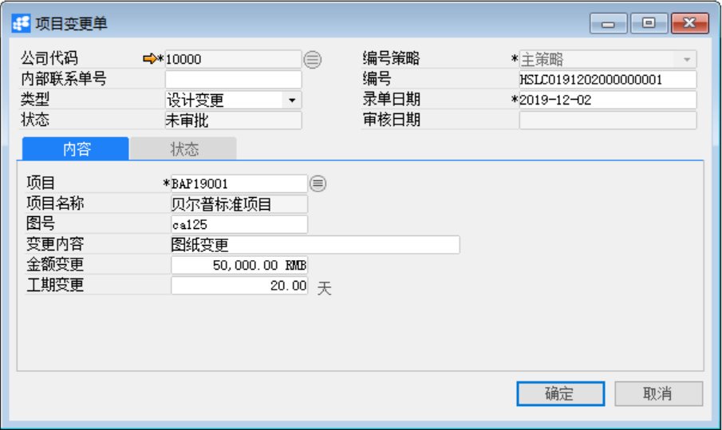

# 项目变更单

发布日期：2019年11月26日

## 功能解释

运用此功能可以对已定义的项目做变更处理。项目变更单主要是对已有的项目的图号、金额、工期的变更。项目变更只是记录不会修改与之关联的数据。

## 文章主旨

本文介绍如何通过BAP Business Cloud AI完成项目变更单的创建、修改和删除操作。

## 操作要求

当前登录用户须拥有对项目变更单创建或更改的操作权限，如何设置该权限请在定义用户权限相关章节中搜索查看。

## 新建项目变更单

1、 单击菜单模块【项目】->【项目管理】->【项目变更单】，打开项目变更单窗口；

2、 选择公司代码，类型，内部联系单号，项目等信息，输入变更内容；

3、点击【添加】按钮，然后点击按钮发起审批。

## 修改项目变更单

1、 单击菜单模块【项目】->【项目管理】->【项目变更单】，打开项目变更单窗口；

2、 点击)按钮，选择需要修改的项目变更单（需要修改的项目变更单的状态必须为未审批或已驳回）；

3、 修改项目变更单内容。点击【更改】按钮保存。

4、 点击按钮发起审批。

## 删除项目变更单

1、 单击菜单模块【项目】->【项目管理】->【项目变更单】，打开项目变更单窗口；

2、 单击工具栏)按钮，选择需要删除的项目变更单（需要修改的项目变更单的状态必须为未审批或已驳回）；

3、 点击工具栏按钮，删除项目变更单；

## 属性与活动描述

| **属性**     | **活动描述**                         |
| ------------ | ------------------------------------ |
| 公司代码     | 选择显示公司代码                     |
| 内部联系单号 | 手动输入内部联系单号                 |
| 类型         | 选择变更单类型                       |
| 状态         | 显示改项目变更单据的当前审核类型     |
| 编号策略     | 选择项目变更单的编号策略             |
| 编号         | 根据变不好策略自动生成项目变更单编号 |
| 录单日期     | 输入或自动显示录单日期               |
| 审核日期     | 自动显示项目变更审核日期             |

## 内容

| **属性** | **活动描述**                 |
| -------- | ---------------------------- |
| 项目     | 选择所要变更的项目           |
| 项目名称 | 根据项目代码自动显示项目名称 |
| 图号     | 输入图号                     |
| 变更内容 | 输入变更内容描述             |
| 金额变更 | 输入项目变更的金额           |
| 工期变更 | 输入工期变更天数             |
