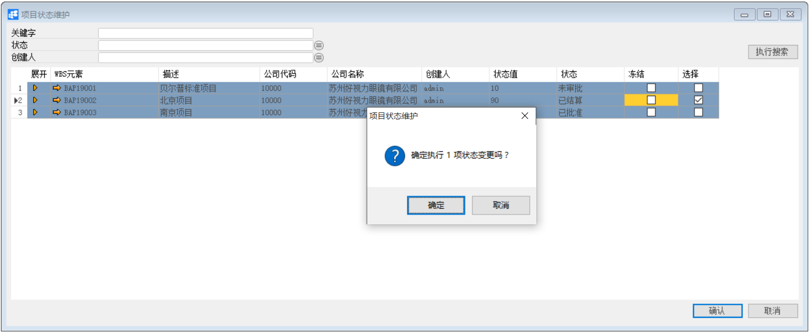

**项目状态维护**

 

**功能解释**

运用此功能可以对已定义的项目进行状态维护。主要为冻结项目和解冻项目。

 

**文章主旨**

本文介绍如何通过BAP Nicer 5完成项目状态维护。

**操作要求**

当前登陆用户拥有操作该项目的权限，权限设置请在定义下项目权限文档中搜索查看。

**冻结项目**

1、 从菜单窗口，【项目】->【项目状态维护】打开项目结构维护界面；

2、 在查找项目窗口输入关键字或选择状态、创建人，单击【执行搜索】按钮；

3、 选择需要冻结的项目，勾选选择复选框，再勾选冻结复选框；（注：只能选择已批准的项目，未审批的项目无法选择）

4、 点击【确认】按钮。

​                                                  

**项目解冻**

1、 从菜单窗口，【项目】->【项目状态维护】打开项目结构维护界面；

2、 在查找项目窗口输入关键字或选择状态、创建人，单击【执行搜索】按钮；

3、 选择需要解冻的项目，勾选选择复选框，再取消冻结复选框；

4、 点击【确认】按钮。

   

**属性与活动描述**

| **属性** | **活动描述**                       |
| -------- | ---------------------------------- |
| 关键字   | 输入内容，更具输入的内容查找项目   |
| 状态     | 选择状态，根据选择的状态查找项目   |
| 创建人   | 选择项目创建人，根据创建人查找项目 |

 