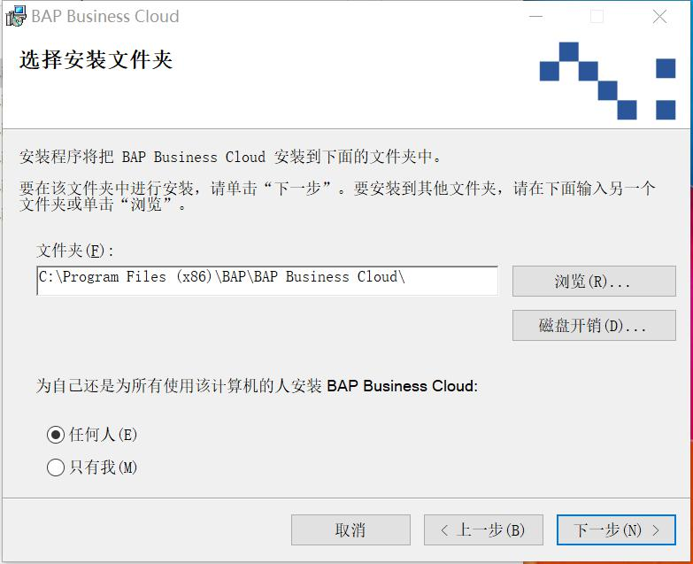
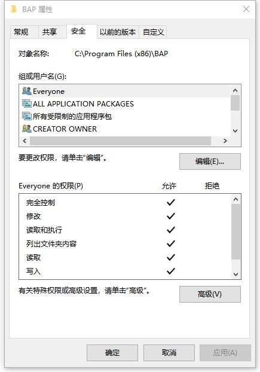

1.准备好安装包

2.双击安装文件【BAP Business Cloud 客户端安装】，点击【下一步】按钮后，显示下图界面，您可以使用安装文件给您推荐的默认设置（优先），也可以点击【浏览】按钮选择安装目录；左下方可以选择任何人或只有我

3.继续点击上图所示的【下一步】按钮，直至开始进入复制文件阶段，然后直到安装结束，注意：在安装过程中可能会有风险提示，请选择忽略或同意继续安装

4.配置安装所在目录的用户文件夹权限，首先本次安装文件夹C:\Program Files(x86)\BAP，然后右键选择属性，在安全选项卡里把everyone添加到用户中，并允许该用户拥有该文件夹的所有权限，如下图所示：

