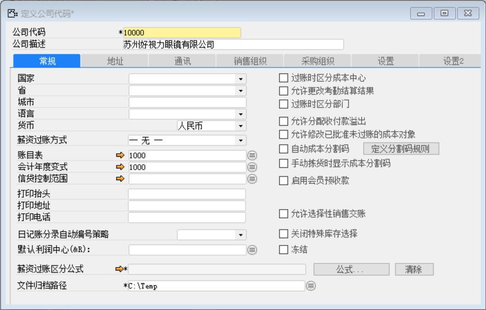

打开路径：【管理】-【系统初始化】-【定义公司代码】

内容表

| **字段**               | **内容**               |
| ---------------------- | ---------------------- |
| 公司代码               | 10000                  |
| 公司描述               | 苏州好视力眼镜有限公司 |
| 货币                   | 人民币                 |
| 账目表                 | 好视力标准会计帐目表   |
| 会计年度变式           | 好视力标准会计年度变式 |
| 日记账分录自动编号策略 | 主策略                 |
| 文件归档路径           | C:\Temp                |

