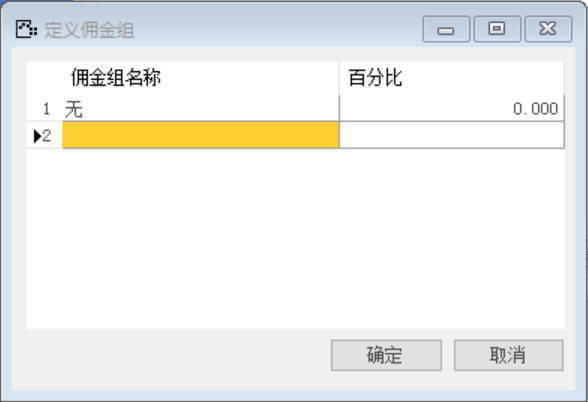
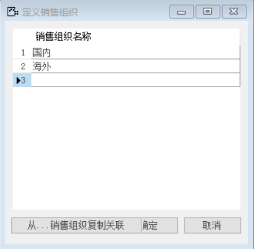
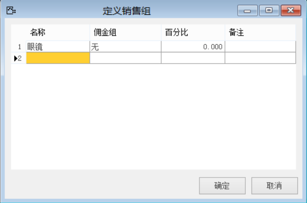

#### 1. **定义佣金组**

打开路径：【管理】-【基础定义】-【一般】-【定义佣金组】

内容表

| **佣金组名称** | **百分比** |
| -------------- | ---------- |
| 无             | 0          |

 

#### **2.定义销售组织**

打开路径：【管理】-【基础定义】-【销售】-【销售组织】

销售组织名称：国内、海外

 

#### **3.定义销售组**

打开路径：【管理】-【基础定义】-【销售】-【销售组】

内容表

| **名称** | **佣金组** | **百分比** |
| -------- | ---------- | ---------- |
| 眼镜     | 无         | 0          |

