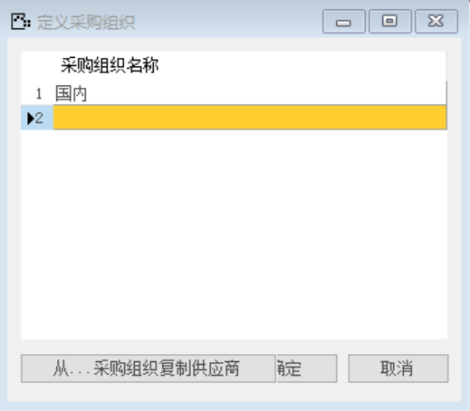
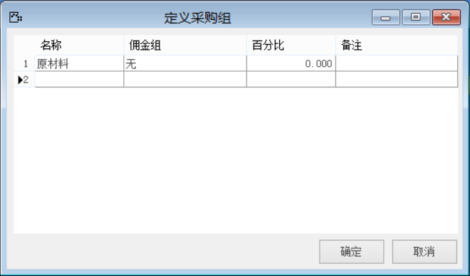

#### 1. **定义采购组织**

打开路径：【管理】-【基础定义】-【采购】-【采购组织】

采购组织名称：国内

 

#### 2. **定义采购组**

打开路径：【管理】-【基础定义】-【采购】-【采购组】

内容表

| **名称** | **佣金组** | **百分比** |
| -------- | ---------- | ---------- |
| 原材料   | 无         | 0          |

