#### 1. **定义公假**

打开路径：【管理】-【基础定义】-【生产】-【定义公假】

内容表

| **代码** | **摘要** |
| -------- | -------- |
| 元旦     | 元旦     |
| 国庆     | 国庆     |

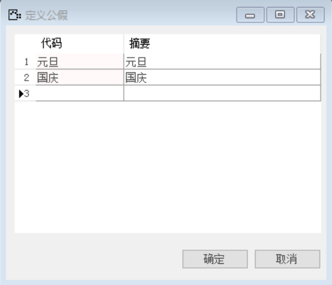 

#### 2. **定义地址格式**

打开路径：【管理】-【基础定义】-【一般 】-【定义地址格式】

名称：中国

第一行：PostCode

第二行：Country;Province;City;Region;Street

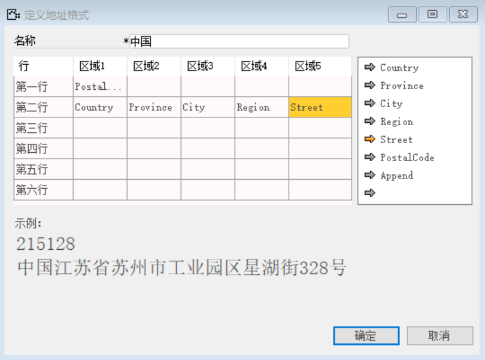 

#### 3. **定义国家**

打开路径：【管理】-【基础定义】-【一般 】-【定义国家】

内容表

| **代码** | **名称** | **地址格式** |
| -------- | -------- | ------------ |
| 中国     | 中国     | 中国         |

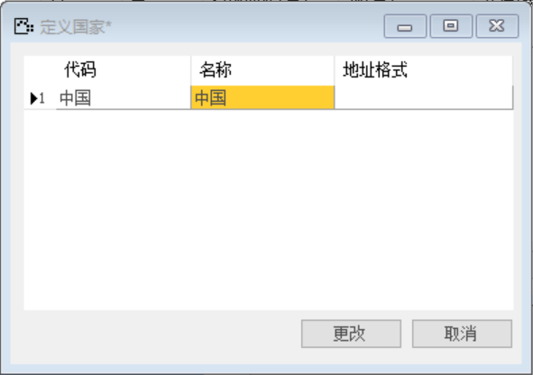 

#### 4. **定义国家假期**

打开路径：【管理】-【基础定义】-【生产 】-【定义国家假期】

内容表

| **公假** | **月** | **日** | **有效期从（年）** | **到（年）** | **共计（天）** |
| -------- | ------ | ------ | ------------------ | ------------ | -------------- |
| 元旦     | 1      | 1      | 2018               | 2099         | 1              |
| 国庆     | 10     | 1      | 2018               | 2099         | 1              |

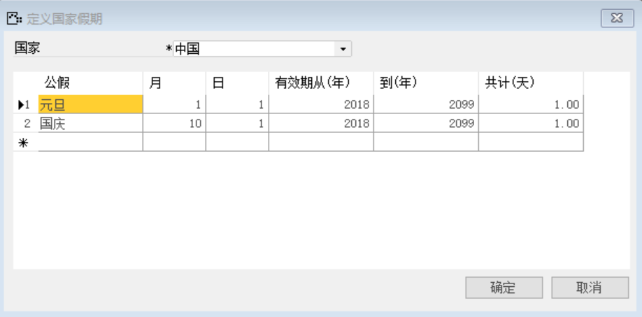 

#### 5. **定义工厂日历**

打开路径：【管理】-【基础定义】-【生产】-【定义工厂日历】

内容表

| **字段** | **内容**                               |
| -------- | -------------------------------------- |
| 日历代码 | 1000                                   |
| 日历描述 | 好视力标准工厂日历                     |
| 节假日历 | 中国                                   |
| 有效期从 | 2018年到2099年                         |
| 工作日   | 星期一、星期二、星期三、星期四、星期五 |

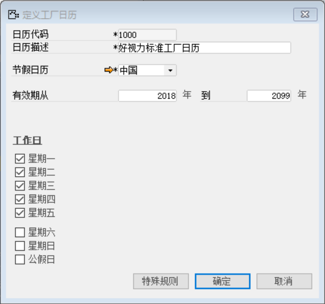 

#### 6. **定义工厂**

打开路径：【管理】-【基础定义】-【生产】-【定义工厂】

（1） 定义工厂常规信息

内容表

| **字段** | **内容**           |
| -------- | ------------------ |
| 工厂代码 | 10001              |
| 全称     | 好视力制造工厂     |
| 简称     | 好视力制造工厂     |
| 日历     | 好视力标准工厂日历 |

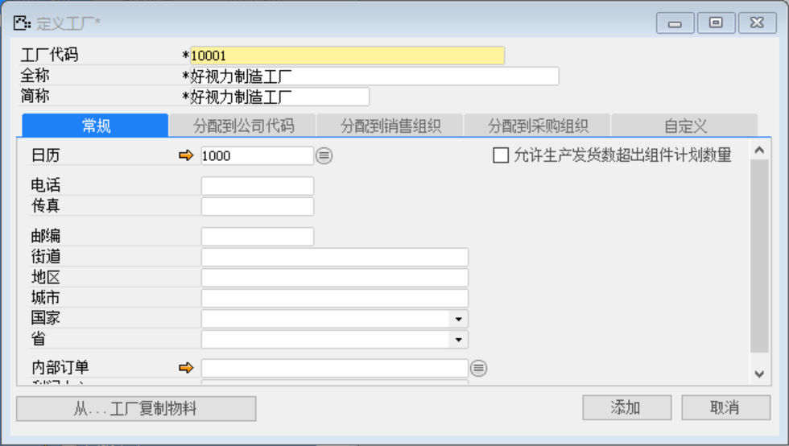 

（2） 定义工厂分配到公司代码：10000

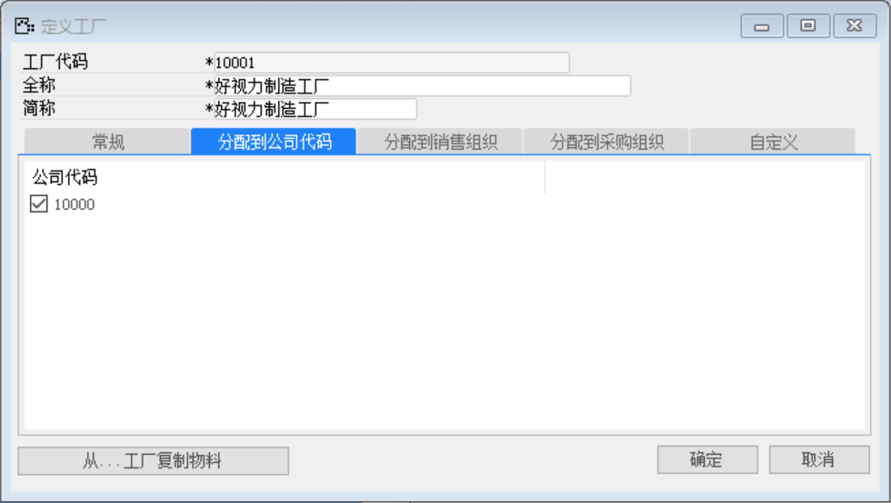 

（3） 分配到销售组织：国内、海外

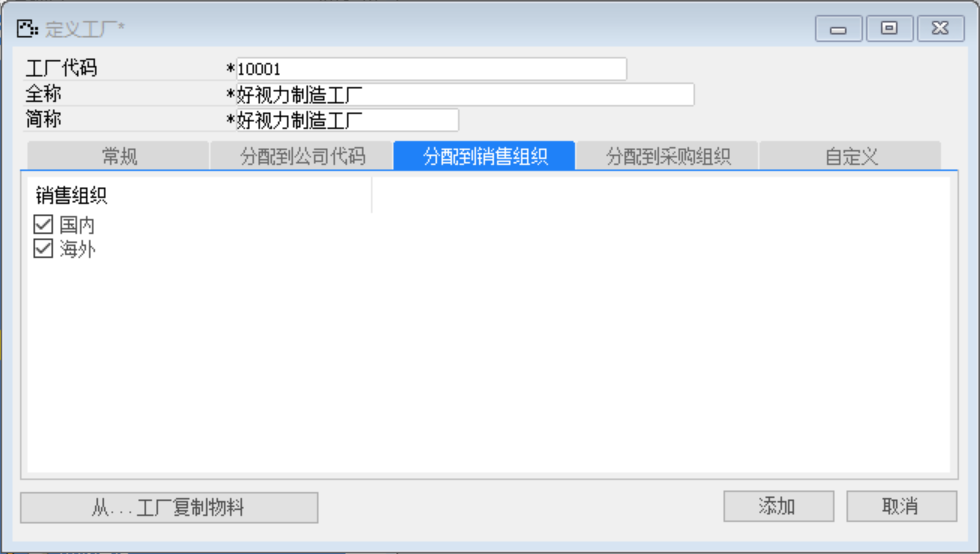 

（4） 分配到采购组织：国内

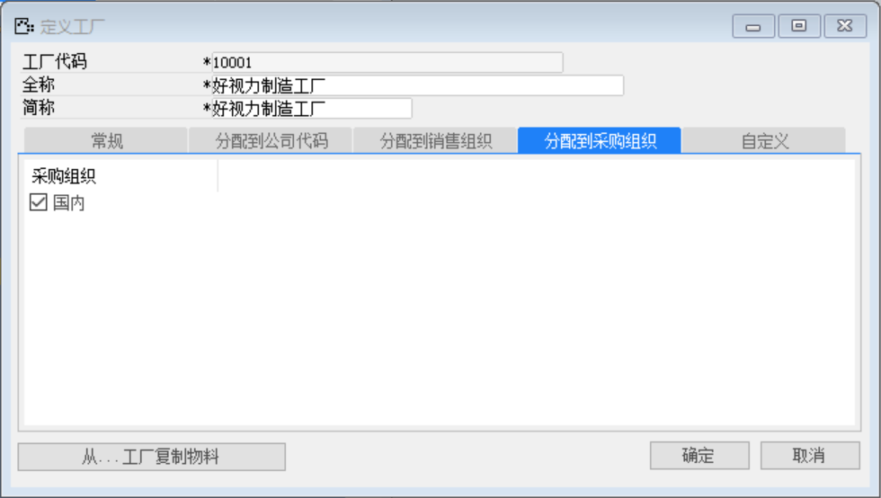 

#### 7. **定义仓库**

打开路径：【管理】-【基础定义】-【库存】-【仓库】

(1) 定义原材料仓库

内容表

| **字段**   | **内容**       |
| ---------- | -------------- |
| 仓库代码； | 1000           |
| 仓库名称   | 原材料仓库     |
| 位置       | 公司(见下文)   |
| 工厂编号   | 好视力制造工厂 |

 

注：定义位置

位置名称：公司

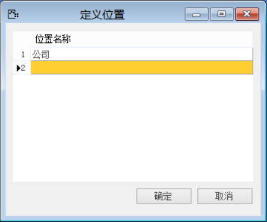 

(2) 定义产品仓库

内容表

| **字段** | **内容**       |
| -------- | -------------- |
| 仓库代码 | 2000           |
| 仓库名称 | 产品仓库       |
| 位置     | 公司           |
| 工厂编号 | 好视力制造工厂 |

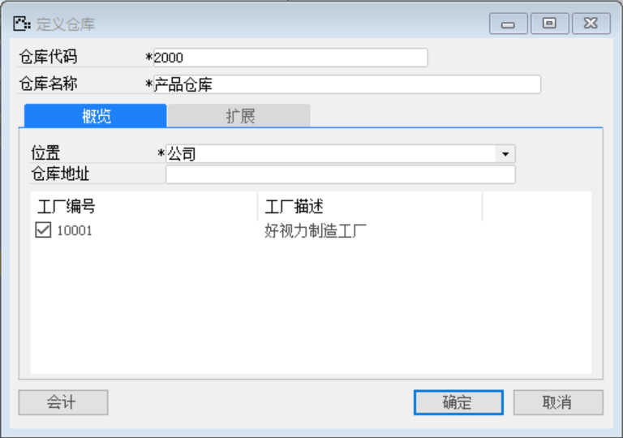

