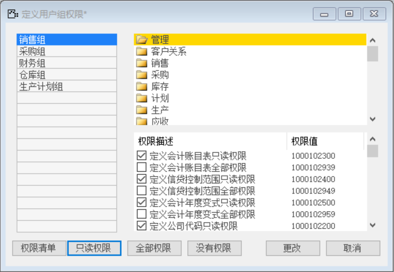
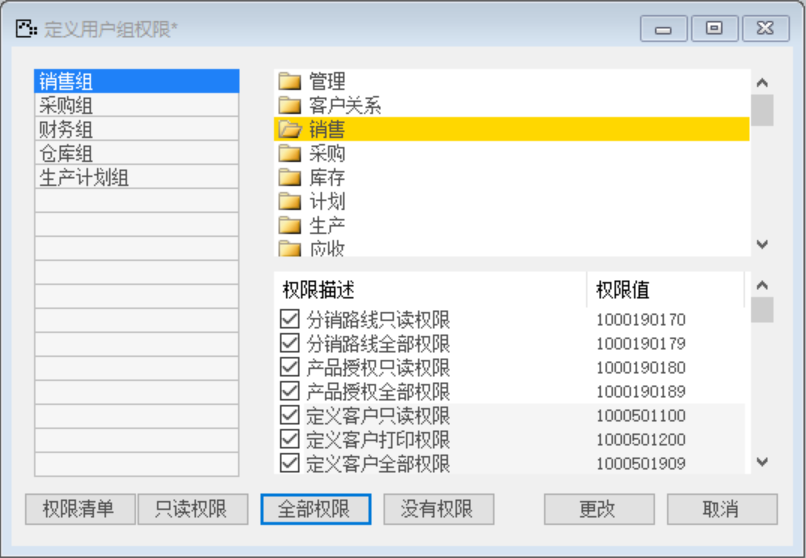

#### 1. **定义用户组**

打开路径：【管理】-【基础定义】-【一般】-【定义用户组】

内容表

| **用户组名称** | **描述**     |
| -------------- | ------------ |
| 销售组         | 销售部门用户 |
| 采购组         | 采购部门用户 |
| 财务组         | 财务部门用户 |
| 仓库组         | 仓库部门用户 |
| 生产计划组     | 生产计划用户 |

 

#### 1. **定义用户组权限**

打开路径：【管理】-【基础定义】-【一般】-【定义用户组权限】

销售组：管理只读权限、销售全部权限

 

 