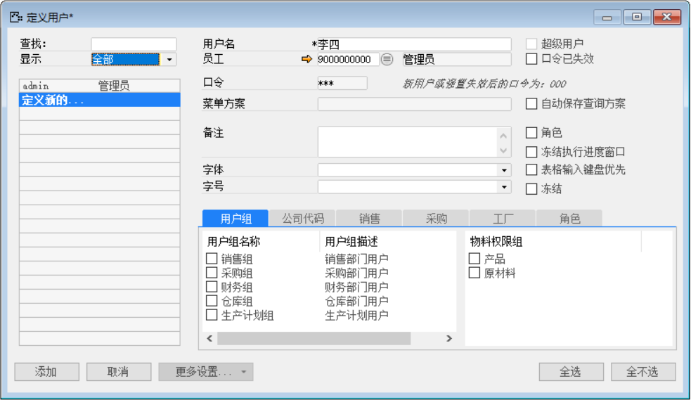
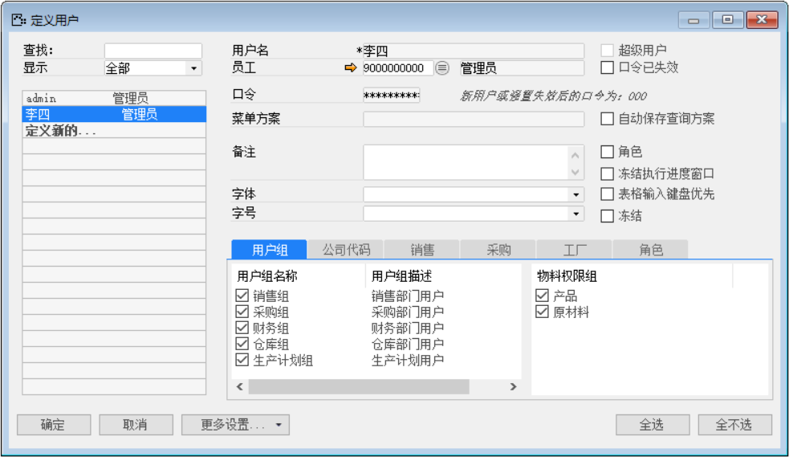
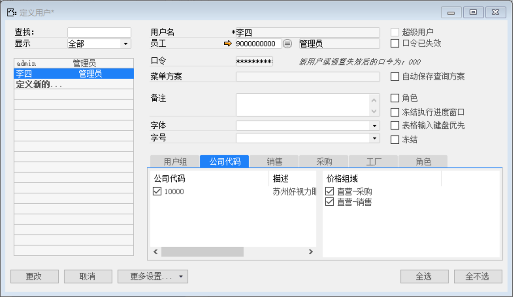
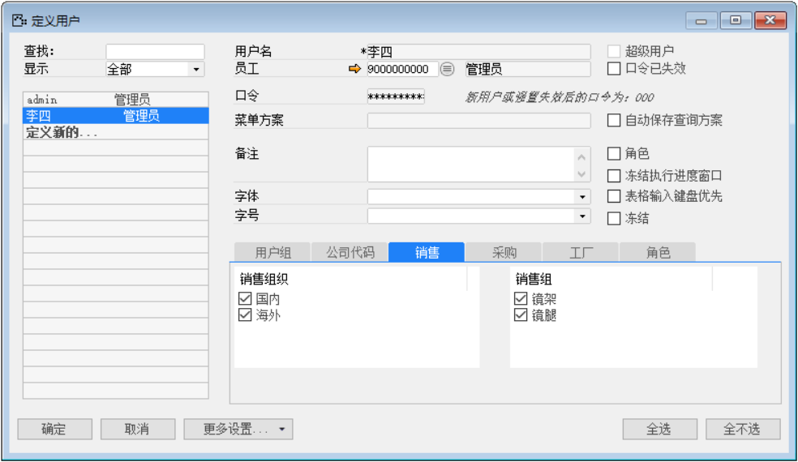
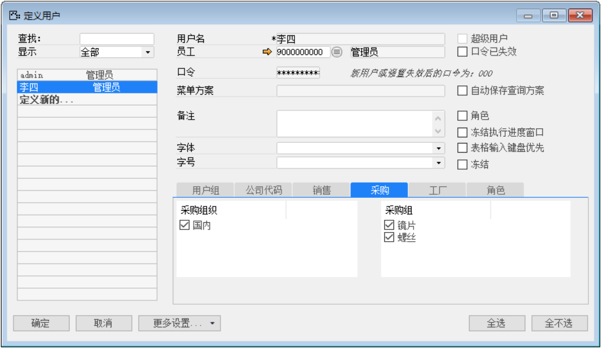
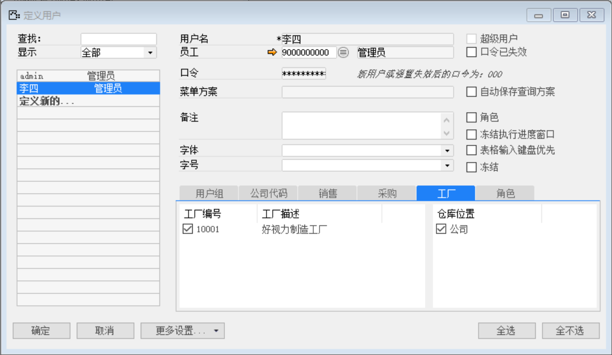

打开路径：【管理】-【基础定义】-【一般】-【定义用户】

1. 创建用户

内容表

| **字段** | **内容**          |
| -------- | ----------------- |
| 用户名   | 李四              |
| 员工     | 9000000000-管理员 |
| 口令     | 000               |

 

2. 分配用户组和物料权限组

 

3. 分配公司代码和价格组域

 

4. 分配销售组织和销售组

 

5. 分配采购组织和采购组

 

6. 分配工厂和仓库位置

 

注：admin用户的操作同上