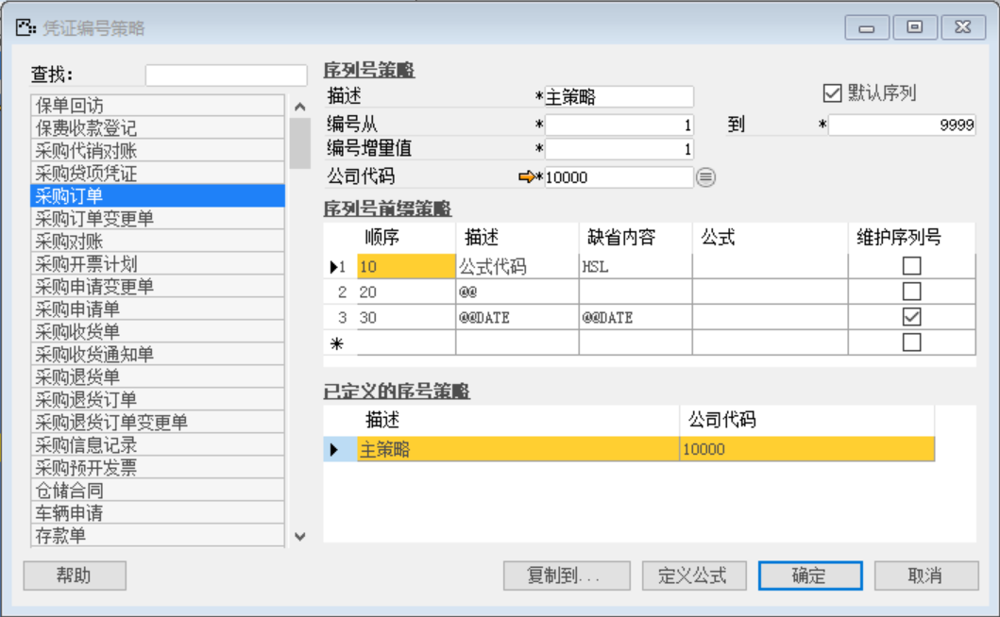
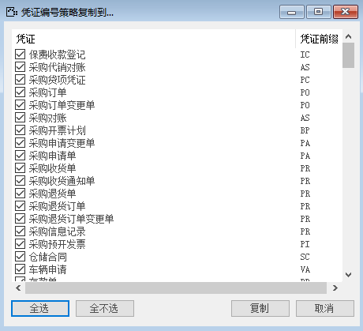

打开路径：【管理】-【系统初始化】-【凭证编号策略】

内容表

| **字段**   | **内容**             |
| ---------- | -------------------- |
| 描述       | 主策略(勾选默认序列) |
| 编号从…到… | 1到9999              |
| 编号增量值 | 1                    |
| 公司代码   | 10000                |

 

| **顺序** | **描述** | **缺省内容** | **公式** | **维护序列号** |
| -------- | -------- | ------------ | -------- | -------------- |
| 10       | 公式代码 | HSL          |          |                |
| 20       | @@       |              |          |                |
| 30       | @@DATE   | @@DATE       |          | ✔              |

 

将该策略复制到其他凭证：【复制到】-【全选】-【复制】-【是】

